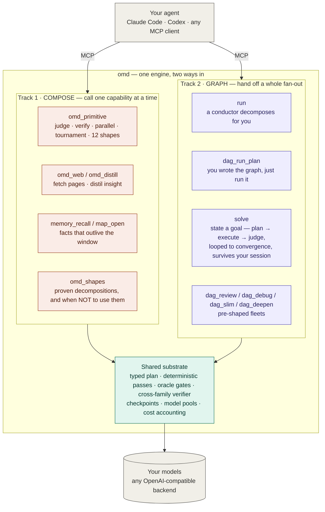
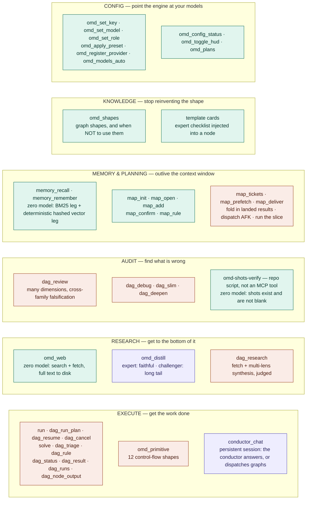
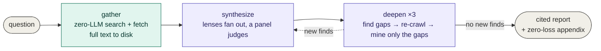
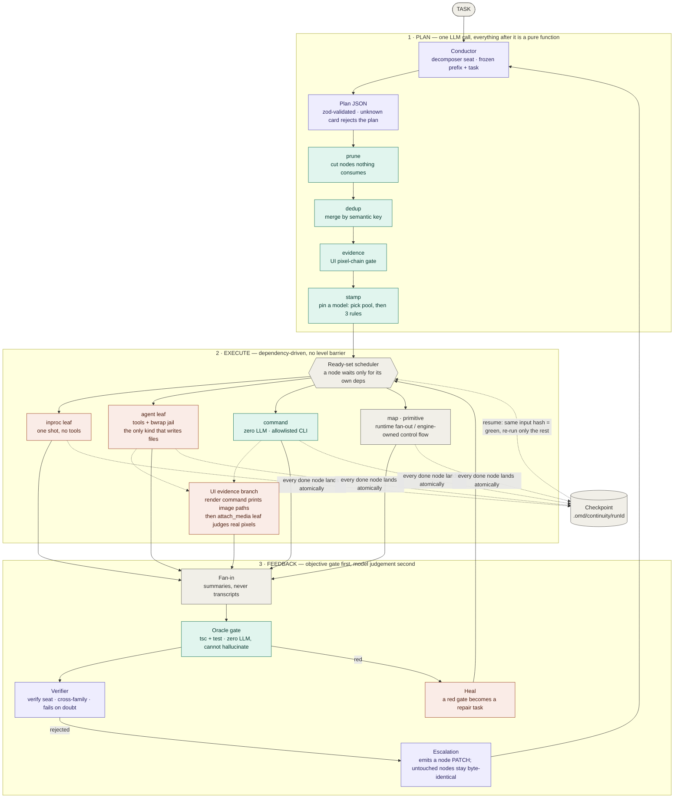
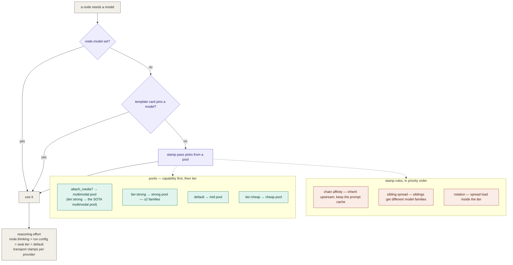

<div align="center">

# oh-my-dag

### Two ways to put cheap concurrent models behind your agent — call one capability, or hand off a whole graph.

*Your agent stays the brain. omd brings the hands, the gates, and the memory.*

[](docs/mcp-tools.md)
[](client-skills/)
[](docs/model-layer.md)
[](https://bun.sh)
[](LICENSE)

**English** · [中文](README.zh-CN.md) · **[Get started →](docs/MCP-ONBOARDING.md)**

</div>

## The two tracks

Your coding agent is a strong, expensive brain. Using it to *type out* every file, read every
page, and hold every plan in its head is the wrong job for the smartest thing in the room.

omd gives that agent two ways to delegate — and they share one substrate, so switching tracks
never costs you reliability:



**Track 1 — compose.** Call one capability and look at the result: run a `judge` over three
attempts, fetch and distil a page, recall what you decided last week. Two to five steps, you
stay in the loop.

**Track 2 — graph.** Hand off a whole fan-out: a task becomes typed nodes, they run the moment
their dependencies settle, every node is checkpointed, and an interrupted run resumes instead of
restarting. Ten nodes or a hundred, you go do something else.

The dividing line is **scale**, and the caller is the best judge of it. The four deterministic
passes that make a graph worth it (prune, dedup, evidence, stamp) buy nothing on a 3-step
composition and are load-bearing on a 40-node one.

## Quick start

```bash
git clone https://github.com/AbyssCN/oh-my-dag.git && cd oh-my-dag
bun install && bun link      # puts `omd` on your PATH (Bun ≥ 1.3)
omd init                     # wizard: keys, model presets, reachability probe → .env
```

```bash
cd <your-project> && claude mcp add omd -- omd mcp
```

The slash-command pack (`/omd-path`, `/omd-review`, … 20 skills) installs itself into
`~/.claude/skills/` on first server start — idempotent, and it never overwrites a skill you
edited. Opt out with `OMD_INSTALL_SKILLS=0`.

**→ [Full walkthrough](docs/MCP-ONBOARDING.md)** · [command reference](client-skills/README.md)

<details>
<summary>Configuring the backend</summary>

Run `bun run init` for an interactive wizard, or set `OMD_RUNTIME_PROVIDER` +
`OMD_RUNTIME_MODEL` + your backend key in `.env` by hand (copy
[.env.example](.env.example)).

**The terminal UI is back.** The bundled UI was removed on 2026-08-01 and returned on
2026-08-07 as omd's own TUI — `omd tui` opens a chat seat with seat/model pickers and
run/session views ([docs/tui.md](docs/tui.md)). Your MCP client remains a full front
end — either way the conversation drives the same engine.

</details>

## What you can call



**Execution** — `run` (a conductor decomposes for you) · `dag_run_plan` (you wrote the graph)
· `dag_resume` (pick up where a broken run stopped) · `solve` (state the goal; the engine plans,
executes, judges and repairs until it converges — four stop axes: rounds, no-progress, judge ∧ accept,
token/minute budget; `detached: true` hands it to a worker process that outlives your session) ·
`dag_cancel` (cooperative stop, resumable) · `dag_triage` / `dag_rule` (owner inbox: a running graph
raises a decision fork with the assumption it is proceeding on; your ruling enters the next round
verbatim) · `omd_primitive` (one control-flow shape, no graph required) · `conductor_chat` (a persistent
conductor session: ask it questions, or let it dispatch graphs mid-conversation) · `dag_status` /
`dag_result` / `dag_node_output` / `dag_runs`.

**Research** — `omd_web` (search + fetch, **zero LLM**; full text to disk, only an index comes
back) · `omd_distill` (two lenses over text you already have: one faithful, one adversarial) ·
`dag_research` (fetch + multi-lens synthesis with a judge panel).

**Audit** — `dag_review` (multi-dimension diff review, each dimension routable to a different
model family) · `dag_debug` · `dag_slim` (deletion-only over-engineering audit) · `dag_deepen`
(architecture hotspots).

**Memory & planning** — `memory_recall` / `memory_remember` ·
`map_init` / `map_open` / `map_add` / `map_confirm` / `map_rule` / `map_tickets` /
`map_deliver` / `map_prefetch` (a decision map in git, advanced by typed tickets —
machine-suggested tickets must pass `map_confirm` before they can be ruled on — with
background research that outlives your client).

**Knowledge** — `omd_shapes` (proven graph shapes, each with the trigger *and* the "not when")
· template cards (a vetted specialist checklist injected into a node at run time).

**Config** — `omd_config_status` / `omd_set_model` / `omd_set_role` / `omd_apply_preset` / …

**→ [Full tool reference](docs/mcp-tools.md)**

## Deep research, benchmarked

One command fans a question across cheap concurrent models, keeps every source on disk with zero
loss, synthesizes through competing lenses, closes its own gaps by re-crawling, and lets a judge
panel pick the winner.

```bash
bun run scripts/dag-research.ts "<your question>" --deep
```

We put it head-to-head against an all-frontier alternative on the same question (a mid-2026 MCP
ecosystem review). **System A** — omd `--deep` on cheap seats. **System B** — a 106-agent
Claude workflow where every agent is a frontier model.

| | **A · omd `--deep`** | **B · 106-agent frontier workflow** |
|---|---|---|
| Cash cost | **$2.19** | subscription quota · 3.76M tokens |
| Result | 132k-char report · 32 sources | 23 claims, verified 3-of-3 |
| The catch | finished clean | hit the limit before it finished |

> **A cheap stack reproduced 13 of the 15 facts the frontier workflow verified — for $2.19.**

Not because the small models are secretly frontier-grade. Because deep research has a **deterministic
retrieval floor**: `omd_web` fetches with no model in the loop, full text lands on disk, and gaps
close by *re-crawling the missing source*, never by a model filling them from memory. The model does
synthesis; the engine does recall. That is the whole repo's thesis, measured on one task —
*reliability comes from outside the model.*



**→ [How it works, the models, and the full A/B benchmark](docs/deep-research.md)** ·
[sample output](docs/examples/deep-research-mcp-2026.md)

## How the graph runs

A task is planned **once** by an LLM, then transformed by **pure functions**, then executed by
dependency order. Everything after the conductor is deterministic.



*Purple = an LLM call · teal = deterministic, zero LLM · coral = executor · grey = engine structure.*

**Node kinds** — what a node can be:

| Kind | Model? | Tools? | Use for |
|---|---|---|---|
| `leaf` (`inproc` in code) | one shot | no | generation, judgement, drafting |
| `agent` | yes | read/edit/write/bash — jailed **only** on `branchStrategy: 'branch'` (see below) | **the only kind that writes files** |
| `command` | **none** | a CLI from an allowlist | gates (`tsc`/tests), scanners, indexed lookups |
| `map` | mixed | — | runtime fan-out: a lister discovers the work-list, one child per item |
| `primitive` | mixed | — | control-flow shapes the engine owns (12 composable + gated `escape-hatch`) |
| `research` | yes | live web retrieval | grounded research — **fails loudly** without a web runner instead of citing from model memory |
| `conductor` | yes | — | expands a subgraph at run time; hosts the goal loop's re-plan rounds |

**Where a run's writes land, and what contains them** — `solve` takes `branchStrategy`:

| | `head` (default) | `branch` |
|---|---|---|
| Writes go to | your current working tree | an isolated git worktree on `omd/run/<runId>`; the engine never merges back — you do |
| Agent leaf **write** face | anchored at the run's cwd, but an **absolute path still escapes** (measured, not theorised) | bwrap jail — the leaf process only sees that worktree, so there is nothing outside to address |
| Agent leaf **read** face | **your whole filesystem** — no jail | `HOME=/tmp`, `/home` not mounted → `~/.ssh` does not exist inside the jail |
| Command leaf | allowlist + dangerous-pattern table (both modes) | same |

**This is a deliberate ruling, not an oversight** (2026-07-31): `head` is the "I'm here, I'm
watching" mode, and reading outside the repo is the reason it exists. If a node were ever hijacked
— say by injected text inside a fetched web page — the execution face is held by the command
allowlist (live-verified: rejected twice), but the **read** face in `head` is open by design.
Run `branchStrategy: 'branch'` for anything unattended, anything that fetches the open web, or
anything you would not want reading `~/.ssh`. If bwrap is missing on the box, the engine says so
loudly and degrades to path-level isolation only.

**Plan passes** — pure functions between the plan and execution: `prune` (drop dead nodes) →
`dedup` (semantic-key merge) → `evidence` (UI pixel-chain gate) → `stamp` (pin a model on every node).

**Control-flow primitives** — you pick the shape and its params; the loop / branch / stop /
scoring logic belongs to the runtime, never to the model: `parallel` · `pipeline` · `loop-until` ·
`verify` · `judge` · `discovery` · `iterate` · `tournament` · `router` · `race` · `escalation` · `saga`.
A gated thirteenth, `escape-hatch`, exists but stays off unless `OMD_ESCAPE_HATCH=1`.

**→ [Architecture in depth](docs/architecture.md)** · [primitives](docs/primitives.md) ·
[diagram source](docs/diagrams/01-engine-flow.md)

## Which model runs which node



Two things stay deliberately separate: a **template card** says *how* the work is done (method,
checklist, output discipline); a **seat or pool** says *who* does it (which model coordinate).
They compose freely — the same card runs on any model, one model executes many cards. That is the
main structural difference from a subagent, where "who" and "how" are welded into one definition.

### The seats at a glance

omd routes work to 16 named seats in four functional classes. Pin any of them once in
`.omd/config.json` `models` and every resolver reads that one value. Rule of thumb: **strong where
being wrong is expensive and rare; cheap where volume is high and an oracle catches mistakes.**

| Class | Seats | Does | Reach for |
|---|---|---|---|
| decomposer | `conductor` · `escalation` | shapes / repairs the plan graph | **strong** (SOTA brain) |
| judge_synth | `judge` · `gate` · `reason` · `reduce` | picks winners, closes the goal loop, folds results | **strong** to judge; cheaper to fold |
| worker | `leaf` · `agent` · `lens` · `expand` · `distill` · `overflow` · `continuity` | volume execution behind a gate | **cheap–mid** (family ≠ quality here) |
| verify | `verifier` · `review-spec` · `review` | adversarial cross-check | **mid, different family** from the author |

Auto-assign fills these by **channel economics**, not by scattering families — diversity is spent only
where it changes the answer (verify is off the author's family on purpose; research `lens` seats want
several). Full per-seat table, the weak/strong rationale, and how to register OAuth/subscription models
(Claude · GPT · Kimi) → **[model configuration guide](docs/model-config.md)**.

**→ [Model layer in depth](docs/model-layer.md)** · [diagram source](docs/diagrams/04-model-layer.md)

## Why it holds together

Two halves of one principle. Systems that state only the first end up mechanising the model away;
systems that state only the second end up trusting it where trust is not checkable.

> **Reliability comes from outside the model.** Gates judge — did it happen, is it there, does it
> pass? Deterministic, zero-model, fail-closed. A model "having a look" is not a gate: when it
> silently does not run, nothing turns red.
>
> **Creativity comes from inside it.** Models generate — what to do, how to do it, what is still
> missing. Inside the gates, do not replace this with rules. Replacing generation with a mechanical
> rule marks a frontier model down to the expressive power of that rule.

Three corollaries that decide real designs:

1. **A deterministic detector is a floor, not a ceiling.** It guarantees the obvious miss does not
   get missed; it must never become the only thing allowed to notice something.
2. **Termination belongs to the engine; content belongs to the model.** Round caps and quorum are
   counted by the engine. Asking a model "are we done yet?" reintroduces the silent failure gates exist to remove.
3. **Gates sit at the joins, not on every step.** Treat a capable model like a capable person: check
   the work where being wrong is expensive; don't look over their shoulder while they think.

## Design rules

- **Contracts over prose.** Every seam is a typed schema; a plan that fails validation never runs.
- **Fail closed at the edges, fail open in the bookkeeping.** An unknown template name rejects the
  plan; a checkpoint that cannot be written only warns.
- **No silent success.** A file-producing node with no file on disk is a failure, not a claim taken
  on trust. Same for a "reviewed" screenshot that never existed.
- **Cross-family or it doesn't count.** A verifier from the author's own model family shares its
  blind spots; so do three research lenses on one family.

## Docs

| | |
|---|---|
| [Architecture](docs/architecture.md) | passes, scheduling, fault boundaries, checkpoint & resume |
| [Primitives](docs/primitives.md) | the 13 control-flow shapes, and when to use plain nodes instead |
| [Model layer](docs/model-layer.md) | seats, pools, stamp rules, reasoning effort, multi-perspective review |
| [MCP tools](docs/mcp-tools.md) | all 40 distinct tools (+9 legacy aliases), grouped |
| [Memory](docs/memory.md) | fact store, hybrid recall, decision maps |
| [Terminal UI](docs/tui.md) | omd's own TUI: chat seat, seat/model pickers, runs & sessions |
| [Open ecosystem](docs/open-ecosystem.md) | external MCP servers & skills on the agent leaf, policy gate |
| [Diagrams](docs/diagrams/) | Mermaid source of truth for every figure above |

## License

MIT — see [LICENSE](LICENSE).
