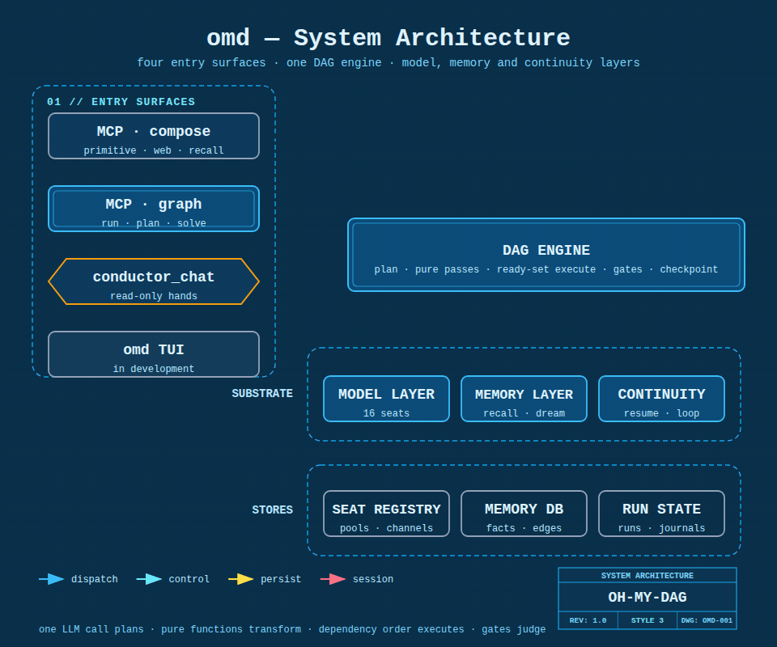
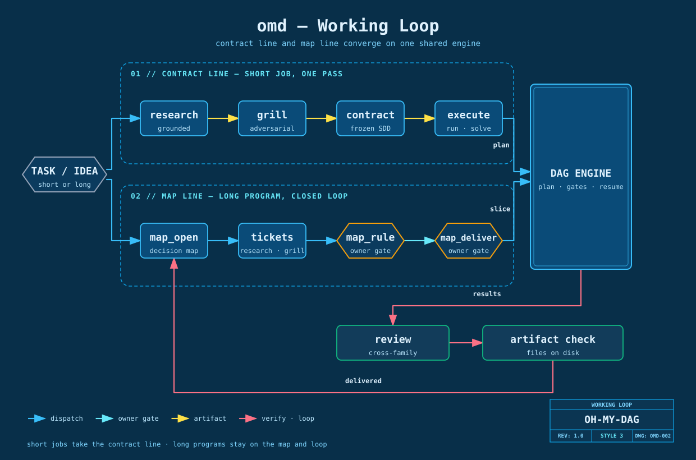
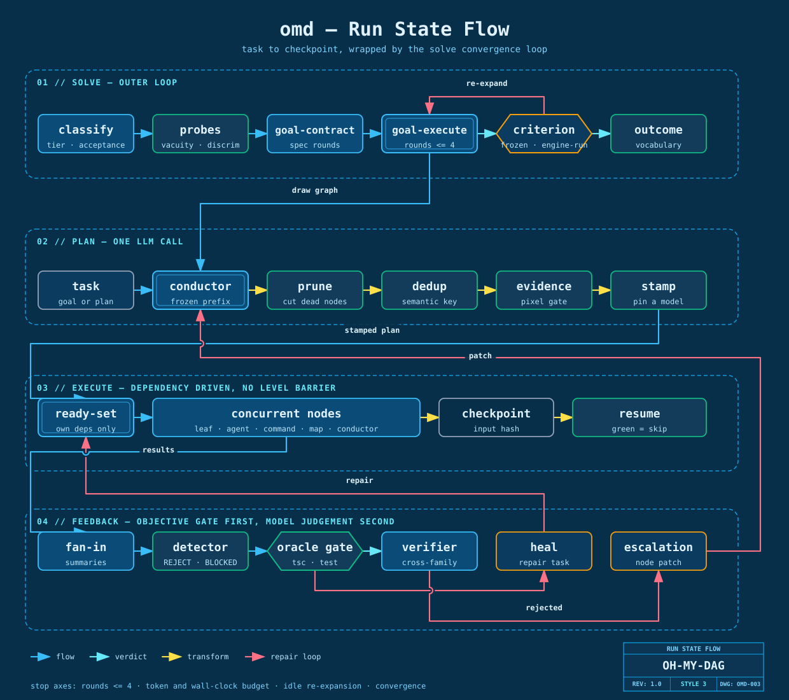

<div align="center">

# oh-my-dag

### An agent of its own — and an open execution engine anything can call.

*Four ways in: compose one capability, hand off a whole graph, talk to the conductor, or open the TUI.*



[](docs/guide/mcp-tools.md)
[](client-skills/)
[](docs/architecture/model-layer.md)
[](https://bun.sh)
[](LICENSE)

**English** · [中文](README.zh-CN.md) · **[Get started →](docs/guide/getting-started.md)**

</div>

## Four ways in

One engine, four doors. Pick by how much you want to hand over at once.

| | |
|---|---|
| **MCP · compose** | Call one capability and look at the result — run a `judge` over three attempts, fetch and distil a page, recall what you decided last week. Two to five steps, you stay in the loop. |
| **MCP · graph & goal** | Hand off a whole fan-out. `run` lets a conductor decompose the task; `solve` takes an *open* goal and researches its way toward one — its findings come back as tickets a human rules on. Already have a crystallised SDD? Pass `sddPath`: the engine compiles it straight to a flat graph — no research pass, no planning tax, the acceptance command is the only stop rule. Ten nodes or a hundred, you go do something else. |
| **`conductor_chat`** | A persistent conductor session over MCP. Ask it questions, or let it dispatch graphs mid-conversation — including from a phone, since the session lives on the server and the run outlives the connection. |
| **`omd tui`** *(in development)* | omd's own terminal client: a chat seat with seat/model pickers and live run views. Usable today, still moving — see [the TUI guide](docs/guide/tui.md). |

Every door lands on the same substrate: a typed plan, deterministic passes, oracle gates, a
cross-family verifier, per-node checkpoints, model pools, and cost accounting.

## Two lanes, one engine

<div align="center">

</div>

**The contract lane** — one task, one pass. Research the ground truth, grill the plan until the
open questions are named, crystallise it into a written contract, then execute against that
contract. The contract is what the executor reads; it never has to guess what the conversation
meant.

**The map lane** — long work across many sessions. A decision map lives in git. Ambiguity becomes
typed tickets, tickets get ruled on, a ruled region gets delivered, and delivery flips the ticket
to `delivered` back on the map. The map is the memory the context window does not have.

The two lanes meet at the same engine and the same gates. And they meet at one deliberate
bottleneck: **`deliver` is the trigger the owner pulls.** A region going quiet only reports; it
never starts writing. Automation is free to research, fetch, plan and argue on its own — changing
files stays a human decision, every time.

## Five problems, five mechanisms

### 1 · "It said it was done. It wasn't."

An objective gate runs before any model judgement: `tsc`, the test suite, a scanner, a file that
must exist on disk. Zero model in the loop, so it cannot be talked into passing. A node that
claims a file it never wrote fails; a "reviewed" screenshot that does not exist fails.

The same discipline applies to the criterion itself. Before an acceptance command is trusted,
the engine runs it twice in a throwaway world — once **before any work exists** (still green
means it has nothing to do with this task), and once against a **deliberately wrong artifact**
the classifier had to supply alongside the command (still green means it cannot tell a right
answer from a wrong one). Either way the goal drops to exploratory instead of collecting a fake
pass. Source: `src/harness/goal/acceptance-gate.ts`.

### 2 · "The context ran out and everything started over."

<div align="center">

</div>

Every finished node lands atomically on disk. Resuming a broken run re-checks input hashes:
nodes whose inputs are unchanged stay green and are not re-billed, and only the rest re-runs.
`solve` with `detached: true` hands the loop to a worker process that outlives your session —
close the client, the graph keeps going. Facts you want to keep go into a store with a hybrid
recall path (a lexical leg and a deterministic hashed-vector leg, both zero-model), so next
week's session can look them up instead of re-deriving them.

### 3 · "Deep research is expensive, and half of it is made up."

Retrieval has a deterministic floor. `omd_web` searches and fetches with **no model in the
loop**: full text lands on disk and only an index comes back. Gaps close by *re-crawling the
missing source*, never by a model filling them from memory. The model does synthesis; the engine
does recall.

```bash
bun run scripts/dag-research.ts "<your question>" --deep
```

Same question — a mid-2026 MCP ecosystem review — run twice, two configurations of our own:

| | **omd `--deep`, cheap seats** | **106-agent frontier workflow** |
|---|---|---|
| Cash cost | **$2.19** | subscription quota · 3.76M tokens |
| Result | 132k-char report · 32 sources | 23 claims, verified 3-of-3 |
| Finished? | ran clean to the end | hit the quota mid-verify |

The cheap configuration independently reproduced **13 of the 15** facts the frontier
configuration had verified. Not because small models are secretly frontier-grade — because the
part that decides fact coverage is retrieval, and retrieval is the part with no model in it.

**→ [Deep research guide, seat assignment, full A/B](docs/guide/deep-research.md)** ·
[sample output](docs/examples/deep-research-mcp-2026.md)

### 4 · "I don't trust a cheap model with anything that matters."

Then don't trust it — check it. Between the plan and execution sit four pure functions (prune
dead nodes, merge duplicates by semantic key, enforce the evidence gate, pin a model on every
node); after execution sits the oracle gate, and after that a verifier drawn from a **different
model family** than the author, because a verifier that shares the author's family shares its
blind spots.

Underneath, work routes to **16 named seats** in four classes — decomposer, judge/synthesis,
worker, verify. Auto-assign fills them by channel economics: strong where being wrong is
expensive and rare, cheap where volume is high and an oracle catches the mistakes, and family
diversity spent only where it changes the answer. Pin any seat once in `.omd/config.json` and
every resolver reads that one value. Registry: `src/model/seats.ts`.

### 5 · "The method only exists inside one person's prompt."

omd ships **20 methodology skills** in the package — adversarial review, root-cause debugging,
contract crystallisation, a decision-map workflow, a deletion-only over-engineering audit, and
more. They install into `~/.claude/skills/` on first server start, idempotently, and never
overwrite a skill you edited.

They are not just for your top-level agent. An `agent` leaf inside a graph gets the **same**
skill set through the same tool, so a method you wrote once applies whether you invoke it by
hand or a node reaches for it forty levels into a fan-out.

## Skills: the method ships with the package

Skills are grouped under an umbrella. Your prompt carries the **listing** — group names and
one-line descriptions — not the bodies. A model that wants a method calls `read_skill` and gets
that one body, at that moment. A hundred installed skills therefore cost roughly a hundred
lines of prompt, not a hundred documents, and the discovery surface stays the same whether you
have three skills or three hundred.

Three roots are scanned, project first: `<cwd>/.omd/skills`, the package's own set, then
`~/.claude/skills`. Same name, project wins.

`/omd-review` for a diff, `/omd-debug` for a bug, `/omd-grill` then `/omd-contract` to lock a
plan, `/omd-path` to open a map — **[the full list and how to write your own →](docs/guide/skills.md)**

## What you can call

Six families, 49 tools.

| | |
|---|---|
| **EXECUTE** | Run a graph, state a goal, resume a broken run, cancel cooperatively, ask a running graph's owner inbox for a ruling, or fire a single control-flow shape without a graph at all. |
| **RESEARCH** | Search and fetch with zero model in the loop, distil text you already have through a faithful lens and an adversarial one, or run a full multi-lens synthesis with a judge panel. |
| **AUDIT** | Multi-dimension diff review with cross-family falsification, root-cause debugging, a deletion-only over-engineering pass, and an architecture-hotspot scan. |
| **MEMORY** | A fact store with hybrid recall, plus a decision map in git advanced by typed tickets — machine-suggested tickets must be confirmed before they can be ruled on. |
| **KNOWLEDGE** | Proven graph shapes, each carrying its trigger *and* its "not when"; template cards that inject a vetted specialist checklist into a node at run time. |
| **CONFIG** | Point the engine at your models: keys, presets, per-seat pins, provider registration, auto-assignment, and a status readout. |

Control flow belongs to the runtime, never to the model: you pick the shape and its parameters
— `parallel`, `pipeline`, `loop-until`, `verify`, `judge`, `discovery`, `iterate`, `tournament`,
`router`, `race`, `escalation`, `saga` — and the loop, branch, stop and scoring logic is the
engine's. A thirteenth, `escape-hatch`, stays off unless you set `OMD_ESCAPE_HATCH=1`.

One safety note: for anything unattended, or anything that fetches the open web, run with
`branchStrategy: 'branch'` — an isolated git worktree plus a jail, so the leaf cannot read or
write outside it. Details in [the engine doc](docs/architecture/dag-engine.md).

**→ [Full tool reference](docs/guide/mcp-tools.md)**

## Quick start

```bash
git clone https://github.com/AbyssCN/oh-my-dag.git && cd oh-my-dag
bun install && bun link      # puts `omd` on your PATH (Bun ≥ 1.3)
omd init                     # wizard: keys, model presets, reachability probe → .env
```

```bash
cd <your-project> && claude mcp add omd -- omd mcp
```

Then either drive it from your MCP client, or run `omd tui` for omd's own terminal seat.
Prefer to configure by hand? Set `OMD_RUNTIME_PROVIDER`, `OMD_RUNTIME_MODEL` and your backend
key in `.env` (copy [.env.example](.env.example)). Skill installation opts out with
`OMD_INSTALL_SKILLS=0`.

**→ [Full walkthrough](docs/guide/getting-started.md)** · [command reference](client-skills/README.md)

## Docs

| | |
|---|---|
| [Getting started](docs/guide/getting-started.md) | install, connect a client, first run |
| [MCP tools](docs/guide/mcp-tools.md) | every tool, grouped, with arguments |
| [Model config](docs/guide/model-config.md) | seats, presets, OAuth/subscription backends |
| [Workflow](docs/guide/workflow.md) | the contract lane and the map lane, end to end |
| [Skills](docs/guide/skills.md) | the umbrella, the shipped set, writing your own |
| [Deep research](docs/guide/deep-research.md) | the pipeline, the seats, the A/B benchmark |
| [TUI](docs/guide/tui.md) | omd's own terminal client *(in development)* |
| [Architecture overview](docs/architecture/overview.md) | how the pieces fit |
| [DAG engine](docs/architecture/dag-engine.md) | node kinds, passes, scheduling, isolation, checkpoints |
| [Goal loop](docs/architecture/goal-loop.md) | plan → execute → judge → repair, and the four stop axes |
| [Memory & dream](docs/architecture/memory-dream.md) | fact store, hybrid recall, consolidation |
| [Model layer](docs/architecture/model-layer.md) | seats, pools, stamp rules, reasoning effort |
| [Primitives](docs/architecture/primitives.md) | the 13 control-flow shapes, and when a plain node is better |
| [Open ecosystem](docs/architecture/open-ecosystem.md) | external MCP servers and skills on the agent leaf |

## License

MIT — see [LICENSE](LICENSE).
</content>
