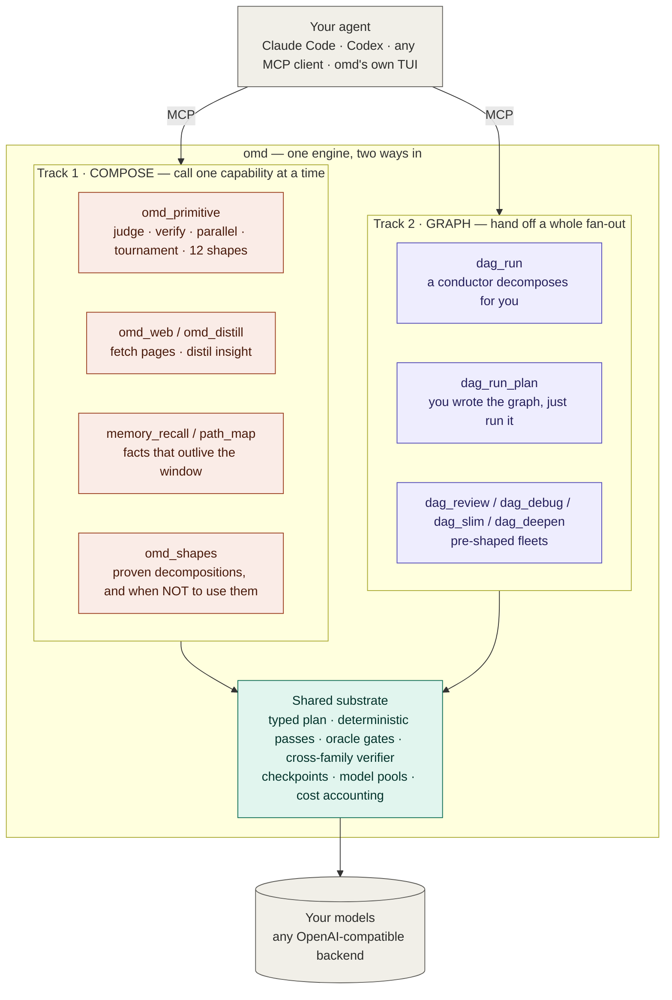
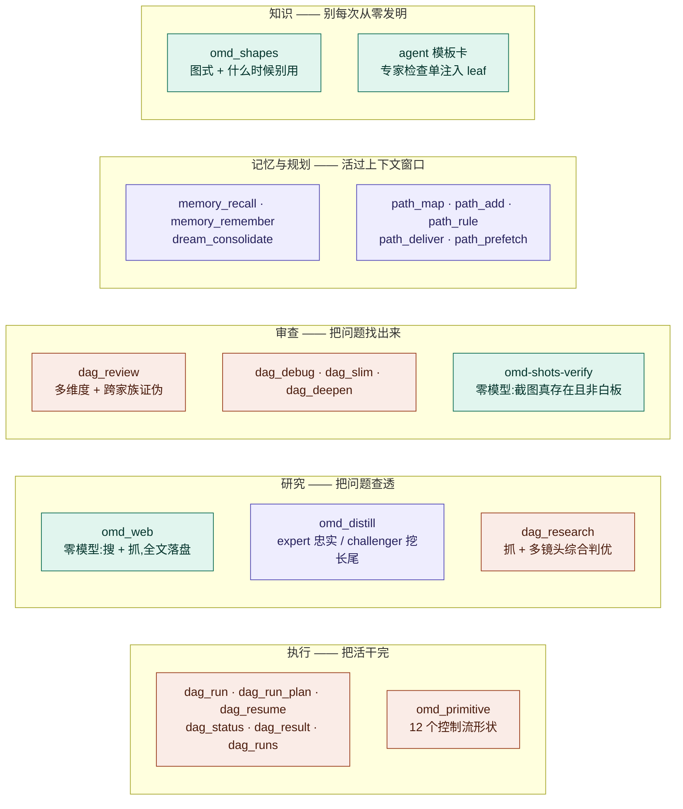
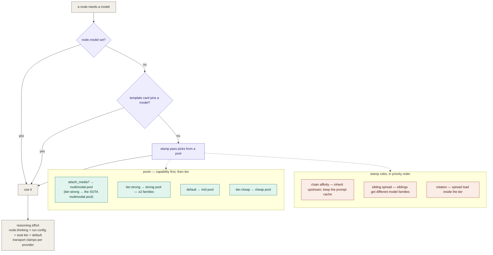

<div align="center">

# oh-my-dag

### Two ways to put cheap concurrent models behind your agent — call one capability, or hand off a whole graph.

*Your agent stays the brain. omd brings the hands, the gates, and the memory.*

[](docs/mcp-tools.md)
[](client-skills/)
[](docs/model-layer.md)
[](https://bun.sh)
[](LICENSE)

**English** · [中文](README.zh-CN.md) · **[Get started →](docs/MCP-ONBOARDING.md)**

</div>

## The two tracks

Your coding agent is a strong, expensive brain. Using it to *type out* every file, read every
page, and hold every plan in its head is the wrong job for the smartest thing in the room.

omd gives that agent two ways to delegate — and they share one substrate, so switching tracks
never costs you reliability:



**Track 1 — compose.** Call one capability and look at the result: run a `judge` over three
attempts, fetch and distil a page, recall what you decided last week. Two to five steps, you
stay in the loop.

**Track 2 — graph.** Hand off a whole fan-out: a task becomes typed nodes, they run the moment
their dependencies settle, every node is checkpointed, and an interrupted run resumes instead of
restarting. Ten nodes or a hundred, you go do something else.

The dividing line is **scale**, and the caller is the best judge of it. The four deterministic
passes that make a graph worth it (prune, dedup, evidence, stamp) buy nothing on a 3-step
composition and are load-bearing on a 40-node one.

## Quick start

```bash
git clone https://github.com/AbyssCN/oh-my-dag.git && cd oh-my-dag
bun install && bun link      # puts `omd` on your PATH (Bun ≥ 1.3)
omd init                     # wizard: keys, model presets, reachability probe → .env
```

```bash
cd <your-project> && claude mcp add omd -- omd mcp
```

The slash-command pack (`/omd-path`, `/omd-review`, … 20 skills) installs itself into
`~/.claude/skills/` on first server start — idempotent, and it never overwrites a skill you
edited. Opt out with `OMD_INSTALL_SKILLS=0`.

**→ [Full walkthrough](docs/MCP-ONBOARDING.md)** · [command reference](client-skills/README.md)

<details>
<summary>Alternative front-end: the bundled terminal agent</summary>

`bun run omd` (interactive) or `bun run omd -p "..."` (one-shot); configure with
`OMD_RUNTIME_PROVIDER` + `OMD_RUNTIME_MODEL` + your backend key in `.env`
(copy [.env.example](.env.example)). The MCP server is the primary door; this is a convenience.

</details>

## What you can call



**Execution** — `dag_run` (a conductor decomposes for you) · `dag_run_plan` (you wrote the graph)
· `dag_resume` (pick up where a broken run stopped) · `omd_primitive` (one control-flow shape, no
graph required) · `dag_status` / `dag_result` / `dag_node_output` / `dag_runs`.

**Research** — `omd_web` (search + fetch, **zero LLM**; full text to disk, only an index comes
back) · `omd_distill` (two lenses over text you already have: one faithful, one adversarial) ·
`dag_research` (fetch + multi-lens synthesis with a judge panel).

**Audit** — `dag_review` (multi-dimension diff review, each dimension routable to a different
model family) · `dag_debug` · `dag_slim` (deletion-only over-engineering audit) · `dag_deepen`
(architecture hotspots).

**Memory & planning** — `memory_recall` / `memory_remember` / `dream_consolidate` ·
`path_map` / `path_add` / `path_rule` / `path_deliver` / `path_prefetch` (a decision map in git,
advanced by typed tickets, with background research that outlives your client).

**Knowledge** — `omd_shapes` (proven graph shapes, each with the trigger *and* the "not when")
· template cards (a vetted specialist checklist injected into a node at run time).

**Config** — `omd_config_status` / `omd_set_model` / `omd_set_role` / `omd_apply_preset` / …

**→ [Full tool reference](docs/mcp-tools.md)**

## How the graph runs

A task is planned **once** by an LLM, then transformed by **pure functions**, then executed by
dependency order. Everything after the conductor is deterministic.


*Purple = an LLM call · teal = deterministic, zero LLM · coral = executor · grey = engine structure.*

**Node kinds** — what a node can be:

| Kind | Model? | Tools? | Use for |
|---|---|---|---|
| `leaf` | one shot | no | generation, research, judgement, drafting |
| `agent` | yes | read/edit/write/bash, in a bwrap jail | **the only kind that writes files** |
| `command` | **none** | a CLI from an allowlist | gates (`tsc`/tests), scanners, indexed lookups |
| `map` | mixed | — | runtime fan-out: a lister discovers the work-list, one child per item |
| `primitive` | mixed | — | 12 control-flow shapes the engine owns |

**Plan passes** — pure functions between the plan and execution: `prune` (drop dead nodes) →
`dedup` (semantic-key merge) → `evidence` (UI pixel-chain gate) → `stamp` (pin a model on every node).

**Control-flow primitives** — you pick the shape and its params; the loop / branch / stop /
scoring logic belongs to the runtime, never to the model: `parallel` · `pipeline` · `loop-until` ·
`verify` · `judge` · `discovery` · `iterate` · `tournament` · `router` · `race` · `escalation` · `saga`.

**→ [Architecture in depth](docs/architecture.md)** · [primitives](docs/primitives.md) ·
[diagram source](docs/diagrams/01-engine-flow.md)

## Which model runs which node



Two things stay deliberately separate: a **template card** says *how* the work is done (method,
checklist, output discipline); a **seat or pool** says *who* does it (which model coordinate).
They compose freely — the same card runs on any model, one model executes many cards. That is the
main structural difference from a subagent, where "who" and "how" are welded into one definition.

**→ [Model layer in depth](docs/model-layer.md)** · [diagram source](docs/diagrams/04-model-layer.md)

## Why it holds together

Two halves of one principle. Systems that state only the first end up mechanising the model away;
systems that state only the second end up trusting it where trust is not checkable.

> **Reliability comes from outside the model.** Gates judge — did it happen, is it there, does it
> pass? Deterministic, zero-model, fail-closed. A model "having a look" is not a gate: when it
> silently does not run, nothing turns red.
>
> **Creativity comes from inside it.** Models generate — what to do, how to do it, what is still
> missing. Inside the gates, do not replace this with rules. Replacing generation with a mechanical
> rule marks a frontier model down to the expressive power of that rule.

Three corollaries that decide real designs:

1. **A deterministic detector is a floor, not a ceiling.** It guarantees the obvious miss does not
   get missed; it must never become the only thing allowed to notice something.
2. **Termination belongs to the engine; content belongs to the model.** Round caps and quorum are
   counted by the engine. Asking a model "are we done yet?" reintroduces the silent failure gates exist to remove.
3. **Gates sit at the joins, not on every step.** Treat a capable model like a capable person: check
   the work where being wrong is expensive; don't look over their shoulder while they think.

## Design rules

- **Contracts over prose.** Every seam is a typed schema; a plan that fails validation never runs.
- **Fail closed at the edges, fail open in the bookkeeping.** An unknown template name rejects the
  plan; a checkpoint that cannot be written only warns.
- **No silent success.** A file-producing node with no file on disk is a failure, not a claim taken
  on trust. Same for a "reviewed" screenshot that never existed.
- **Cross-family or it doesn't count.** A verifier from the author's own model family shares its
  blind spots; so do three research lenses on one family.

## Docs

| | |
|---|---|
| [Architecture](docs/architecture.md) | passes, scheduling, fault boundaries, checkpoint & resume |
| [Primitives](docs/primitives.md) | the 12 control-flow shapes, and when to use plain nodes instead |
| [Model layer](docs/model-layer.md) | seats, pools, stamp rules, reasoning effort, multi-perspective review |
| [MCP tools](docs/mcp-tools.md) | all 33, grouped |
| [Memory](docs/memory.md) | fact store, hybrid recall, dream consolidation |
| [Diagrams](docs/diagrams/) | Mermaid source of truth for every figure above |

## License

MIT — see [LICENSE](LICENSE).
