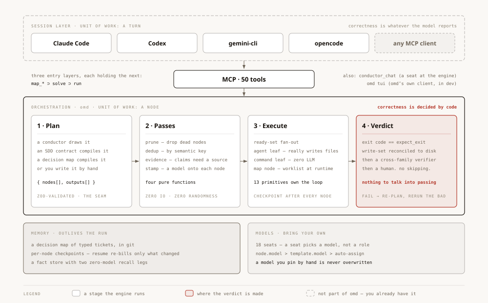
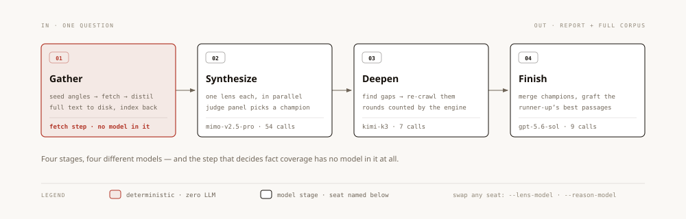

<p align="center">
  
</p>

<p align="center">
  <strong>你的编码 agent 底下那一层:编排层。</strong>
</p>

<p align="center">
  <a href="docs/guide/mcp-tools.md"></a>
  <a href="docs/architecture/model-layer.md"></a>
  <a href="docs/guide/skills.md"></a>
  <a href="https://bun.sh"></a>
  <a href="LICENSE"></a>
</p>

<p align="center">
  <a href="README.md">English</a> · <a href="README.zh-CN.md">简体中文</a> · <a href="docs/why-omd.zh-CN.md">为什么有 omd</a> · <a href="docs/driving-omd.md">这份丢给你的 agent</a>
</p>

你的 agent 说它做完了。omd 不信它这句话。

**50** 个 MCP 工具 · **13** 个控制流原语 · **18** 个模型座位 · **22** 条出厂管线 · **6,818** 个测试。

## 装

```sh
git clone https://github.com/AbyssCN/oh-my-dag.git && cd oh-my-dag
bun install && bun link
omd init
```

然后把你的 agent 指过来:

```sh
cd <你的项目> && claude mcp add omd -- omd mcp
```

`omd init` 问密钥、给三套预设座位表、逐个探测 provider 通不通,然后写 `.env`。server 首次启动把 22 个技能铺进 `~/.claude/skills/` —— 幂等,而且从不覆盖你改过的那一个。还没发 npm,所以 clone 就是安装。

然后跟你的 agent 说:*读 `docs/driving-omd.md`,然后用 omd 去……* —— 那份是操作指南,写给 agent 看的,不是写给你看的。

## omd 在哪一层

今天在跑的编码 harness,拥有的都是**回合**。采样模型、跑它要的工具、结果回灌、再来一轮,模型说完事了就停。它们比上下文压缩、比沙箱纵深,而且比得都不错 —— 但**写这段代码的那一次前向传播,和给它打分的是同一次**。不离开会话,判词就没有别的地方可来。

omd 离开了。工作单位是类型化图里的一个**节点**,而这张图就是一个文件:`{ nodes[], outputs[] }`,zod 校验过。节点有声明过的输入,所以它能被调度、能存档、能续跑、能单独计价、能单独判。回合这些一样都没有。

你手上那个 agent 照用。**活大过一次对话的时候,它调 omd。**

## 它干什么

### 01 · 终点线是一个退出码

多数 harness 在模型写下「done」的时候结束一个任务。omd 在一个 `command` 节点吐出 plan 里声明的那个退出码时才结束 —— `tsc`、你的测试、你的脚本。那个节点里零模型,所以没有任何东西能被说服。旁边还有两道不用你开口就跑的检查:**写集对账**把节点*声称*写过的文件和它真正碰过的比对,**产物闸**去盘上找它点名的那个文件。一个报告了自己从未创建过的文件的节点,在这里判败。

### 02 · 判据自己要先过一场考试

一条对着什么都能过的测试,和一条因为对的理由才过的测试,从外面看一模一样 —— 除非你去查。所以一条验收命令在被相信之前,引擎把它放进仓库的一份临时副本里跑两遍:一遍在**什么活都还没干的时候**,一遍打在一个**故意做错的产物**上(这个错样本是分类器必须连命令一起交出来的)。任何一遍是绿的,目标就降级成 exploratory,而不是把一个假通过收进账。

**这道闸就是这样查出自己坏了的。** 它在 69 次跑里红过 0 次 —— 而一个从不动的数,通常量的是尺子,不是被测物。那个「做错的世界」当时是个空临时目录,而在空目录里 `bun test` 放什么进去都会挂。现在它是仓库的真副本。

### 03 · 每个节点可以是不同的模型

`node.model` 压过 `template.model`,`template.model` 压过自动分派,而**你显式钉的模型永不被覆盖** —— [`stamp-pass.ts:66`](src/harness/plan-passes/stamp-pass.ts)。量大又有 oracle 兜底的地方上便宜模型,判错代价高的地方上强的,需要第二意见的地方换**另一个家族**。auto-assign 按渠道经济学把 18 个座位填满;你钉死任何一个,全库每一处解析都读那一个值。

### 04 · 第二意见来自另一个模型家族

没有退出码能定的事 —— 这份摘要忠于原文吗?这个设计满足契约吗? —— 交给一个 verifier,它对着原始要求读结果。它**故意**跑在与作者不同的模型家族上:同家族就是同盲点,它写出来的坏计划它自己看不见。它的职责被写成攻击结果,不是祝福结果。判 fail 就升级:换更强的 conductor 重画,而且只有被点名的节点重跑。

### 05 · 断掉的活是续跑,不是重来

每个跑完的节点原子地写进磁盘。`dag_resume` 从那份 checkpoint 重载 plan、重算每个节点输入的哈希,**没变的节点保持绿 —— 并且不重复计费**,只有剩下的重跑。`solve --detached` 把环交给一个活得比你会话长的 worker 进程:关掉客户端,图照跑。

### 06 · 检索里没有模型

`omd_web` 的搜索与抓取**零 LLM 在环**。全文写进磁盘,回你上下文的只有一份索引。缺口靠**重抓那个缺席的信源**补上,绝不靠模型凭记忆填。同一个问题上,一次便宜座位的跑花了 **$2.19**,复现了一个 106 agent 前沿档工作流核验过的 15 条事实里的 **13 条** —— 因为覆盖率是检索决定的,而检索是没有模型的那一段。

## 管线是图,不是 prompt

<p align="center">
  
</p>

你 harness 里的一个技能是一段 prompt —— 它只能要求**眼前这一个模型**换个行为。一条管线可以每个阶段挑一个模型,并且在末端挂一条确定性命令。

| | |
|---|---|
| `/omd-research-deep` | 种子抓取 → 多镜头扇出 → judge panel → 缺口补挖。四个阶段,四个模型 |
| `/omd-grill` → `/omd-contract` | 把设计吵清楚,然后写成引擎要执行的那份规格 |
| `/omd-review` | 多维度 diff 审查,每条 finding 跨模型证伪 |
| `/omd-debug` | 复现 → scope lock → 并行假设 → 验证 |
| `/omd-path` · `/omd-rule` · `/omd-deliver` | git 里的决策地图,你来裁决,你拉闸才交付 |

自己搭一条也一样 —— 把图丢给 `dag_run_plan`,逐节点点名模型:

```jsonc
{
  "nodes": {
    "draft_a":  { "goal": "…", "executor": "leaf", "model": "deepseek:deepseek-v4-pro" },
    "draft_b":  { "goal": "…", "executor": "leaf", "model": "minimax-cn:MiniMax-M3" },
    "critique": { "goal": "…", "executor": "leaf", "model": "openai-codex:gpt-5.6-sol",
                  "depends_on": ["draft_a", "draft_b"] },
    "gate":     { "goal": "跑测试", "executor": "command",
                  "command": "bun test", "expect_exit": 0, "depends_on": ["critique"] }
  },
  "outputs": ["gate"]
}
```

跨家族 best-of-N,末端一道硬闸,而且每一个座位都是你挑的。

## omd 唯一不会替你做的事

`map_deliver` 是**你**拉的那道闸。自动化自己调研、抓取、规划、争论;它不会自己决定开始写文件。任何无人值守的活、任何要碰公网的活,传 `branchStrategy: 'branch'`,这趟跑就有自己的 git worktree 和一层牢笼。引擎从不把那个分支合回来。**你读 diff,你决定。**

## 文档

| | |
|---|---|
| [Driving omd](docs/driving-omd.md) | 操作指南 —— 丢给你的 agent 读 |
| [为什么有 omd](docs/why-omd.zh-CN.md) | 长文:在哪一层,以及谁有资格判对错 |
| [上手](docs/guide/getting-started.md) · [MCP 工具](docs/guide/mcp-tools.md) · [模型配置](docs/guide/model-config.md) · [技能](docs/guide/skills.md) · [深度调研](docs/guide/deep-research.md) | 装、工具面、座位 |
| [架构](docs/architecture/overview.md) · [DAG 引擎](docs/architecture/dag-engine.md) · [目标环](docs/architecture/goal-loop.md) · [原语](docs/architecture/primitives.md) | 节点七种、四道纯函数 pass、调度、隔离 |
| [静默失效图鉴](docs/silent-failures.md) | 这台引擎真出过、且当时没有任何红灯的每一类缺陷 |

## 许可

MIT —— 见 [LICENSE](LICENSE)。
