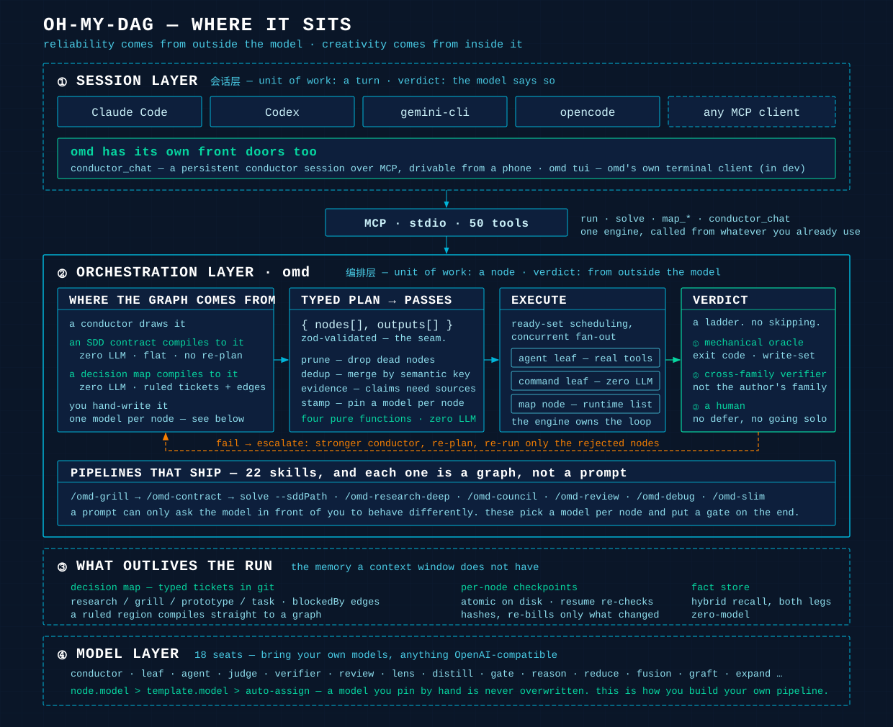
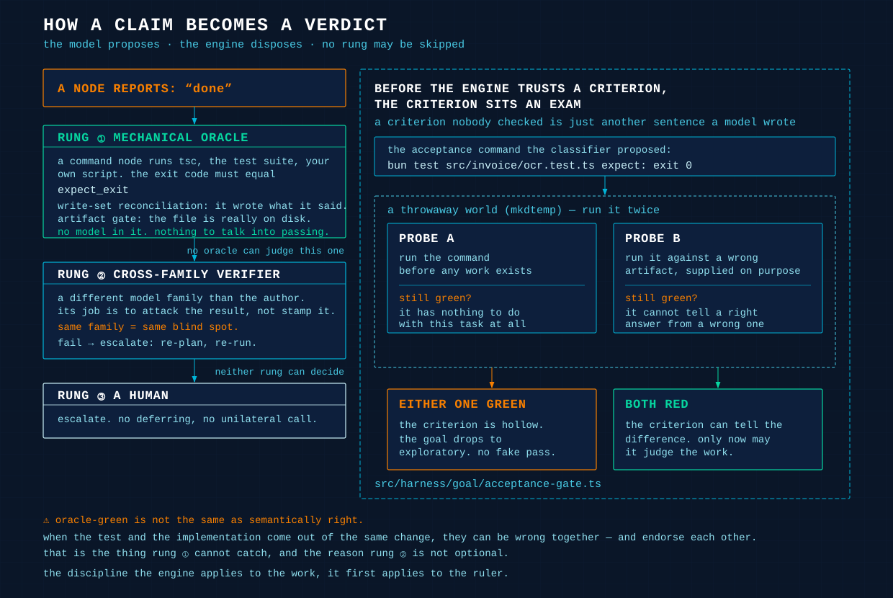

<div align="center">

# oh-my-dag

### 你的编码 agent 底下那一层:编排层。

*agent 说「做完了」,omd 不问它 —— 它把活跑成一张有类型的图,逐节点点名模型,判词取自模型之外。*



[](docs/guide/mcp-tools.md)
[](client-skills/)
[](docs/architecture/model-layer.md)
[](https://bun.sh)
[](LICENSE)

[English](README.md) · **中文** · **[为什么有 omd →](docs/why-omd.md)** · **[这份丢给你的 agent 读 →](docs/driving-omd.md)**

</div>

你关掉标签页。模型说*改动已全部应用*。`git diff` 说那个文件一个字没动。

omd 从不读那句话。它读退出码。

Claude Code、Codex、gemini-cli、opencode 你照用。**一件活大过一次对话时,它们经 MCP 调 omd。**

## omd 在哪一层

2026 年的开源编码 harness —— codex、gemini-cli、qwen-code、opencode、kimi-code、deepseek-harness、oh-my-pi —— 全是**会话层**工具。工作单位是一个回合。主循环是 ReAct:采样、跑工具、结果回灌。它们比上下文压缩、比沙箱纵深、比事件溯源,而且比得都不错。

它们也共享一个前提:**做没做对,由模型自己报告。**

它们做不到别的。干活的那一次前向传播,和评活的那一次,是同一次 —— 同一个上下文,同一套信念。不跨出会话,判词没有别的地方可来。

omd 跨出去了。工作单位是一个**节点**。判词来自**代码**。

|  | 会话层 harness | workflow 引擎<br>(LangGraph, Temporal) | eval / 闸框架<br>(Inspect, promptfoo) | **omd** |
|---|---|---|---|---|
| **工作单位** | 一个回合 | 你写的一步 | 一次打分 | **类型化图里的一个节点** |
| **图从哪来** | 没有图 —— 一个 ReAct 循环 | 你写 | 没有图 | **conductor 画、SDD 契约编译、决策地图编译,或者你亲手写** |
| **谁判对错** | 模型 | 你写的断言 | 你写的评分表 | **oracle → 跨家族 verifier → 人。按这个顺序** |
| **哪个模型在跑** | 你启动的那个 | 你配置的那个 | 不适用 | **一个节点一个,而且你手钉的模型永不被覆盖** |
| **跑一半断了** | 会话结束,重新提问 | 按你的策略重试 | 打完分就结束 | **每节点 checkpoint;续跑只对变过的重新计费** |
| **怎么调它** | 你跟它聊天 | 你嵌进代码 | 你从 CI 调 | **`claude mcp add omd -- omd mcp`** |

**重叠是真的。** LangGraph 和 Temporal 也跑图,eval 框架也设闸,都不是新发明。在这一台引擎里合到一起的是:类型化 plan 当交换格式、闸跑在产出这件产物的那一趟里而不是事后在 trace 上、verifier 取自另一个模型家族、每节点续跑,以及一层 MCP 接口 —— 任何 harness 都能驱动上面全部。

**omd 不是什么:**

- **不是编码 CLI。** 你手上那个 harness 照用。
- **不是聊天 agent。** 它的单位是节点,不是对话。
- **不是 eval 框架。** 你不用给它送 trace。
- **不是厂商产品。** MIT、Bun 上的 TypeScript,任何 OpenAI 兼容模型。

**→ [长文版](docs/why-omd.md)**

## 装

```bash
git clone https://github.com/AbyssCN/oh-my-dag.git && cd oh-my-dag
bun install && bun link      # 把 `omd` 放进 PATH(需 Bun ≥ 1.3)
omd init                     # 向导:密钥、模型预设、可达性探测 → 写 .env
```

```bash
cd <你的项目> && claude mcp add omd -- omd mcp
```

还没发到 npm,所以 clone 就是安装。server 的工作目录**就是**它作用的那个仓库。首次启动把 22 个技能幂等铺进 `~/.claude/skills/`,**从不覆盖你改过的那一个**(`OMD_INSTALL_SKILLS=0` 关掉)。

然后跟你的 agent 说:

> 读 `docs/driving-omd.md`,然后用 omd 去……

**[docs/driving-omd.md](docs/driving-omd.md)** 是写给 agent 看的,不是写给你看的 —— 什么活派哪个工具、为什么绝不能卡在 `runId` 上等、任务怎么写才会长出一道闸、以及它会撞上哪些失败形态。**[给人看的完整上手](docs/guide/getting-started.md)**。

## 判词来自模型之外

<div align="center">

</div>

让模型判自己做没做成,它可以整个不跑,而没有任何东西变红。所以第一级里没有模型。一个 `command` 节点跑 `tsc`、跑测试、或跑你的脚本,退出码必须等于 `expect_exit`。旁边是写集对账 —— 它是不是真写了它声称写的 —— 和产物闸 —— 文件在盘上到底有没有。报告了自己从未写过的文件的节点,判败。

**判据在被信任之前,先过一场考试。** 这一段值得读两遍。引擎把这条验收命令放进临时世界跑两遍:一遍在**什么活都还没干的时候**(还绿 = 它跟这个任务无关),一遍打在一个**故意做错的产物**上(分类器必须连命令一起交出这个错样本;还绿 = 它分不出对错)。两种都让目标降级成 exploratory,而不是收下一个假通过。两条探针都是 fail-open:探针跑不起来时,判据被标成未经证明,而不是把整趟挡下来。`src/harness/goal/acceptance-gate.ts`。

语义 oracle 判不了的,第二级交给**另一个模型家族**的 verifier。同家族,同盲点。它的职责是攻击结果,不是盖章。判 fail 就升级:换更强的 conductor、重画,只有被点名的节点重跑。`src/harness/verifier.ts`。

⚠ **oracle 绿 ≠ 语义对。** 这台引擎真出过:`tsc` 干净、整套测试全绿,而一处状态映射的标签是反的,配套测试还把这个错固定了下来。测试和实装由同一次改动一起产出时,会一起错并且互相背书。第一级抓不到。第三级是人。

> **可靠性来自模型之外。创造力来自模型之内。**
> 闸负责判 —— 确定性、零模型、fail-closed。模型负责生成 —— 做什么、怎么做、还缺什么。闸之内,别把这件事换成规则。

## 图从哪来

四个来源。引擎只校验这份 plan 合不合法。

| 来源 | 代价 |
|---|---|
| **conductor 画** | 一次 LLM 调用。`run` 和 `solve` 走这条 |
| **SDD 契约编译成图** | **零 LLM。** 平铺图,不走调研,不重画 |
| **决策地图编译成图** | **零 LLM。** 裁决过的票加上边,本来就是一张图 |
| **你亲手写** | 零 LLM,完全控制 |

**契约那条道最值得学。** `/omd-grill` 把设计审问到把待决问题一个个点名,`/omd-contract` 把它写成规格,然后 `solve(sddPath: …)` 把规格直接编译成平铺图 —— 验收命令成为唯一的停机规则。规格不是 prompt:它自带分解、自带闸、自带 verify 列,引擎没有留给它猜的余地。

一条前提,并且是真的:规格的 verify 列必须指向**今天天然就红**的东西。测试本来就绿的规格,会让整趟跑变成一次昂贵的空转。

**地图那条道**给活得比会话长的活。歧义变成 git 里有类型的票,你裁决它们,散尽雾的区域编译并执行。**`map_deliver` 是你亲手拉的闸。** 自动化可以自己调研、抓取、规划、争论。它不能自己决定开始写文件。

## 自己搭管线

每个节点都能点名自己的模型,而且**手钉的模型永不被覆盖**。优先级是 `node.model` > `template.model` > 自动分派(`src/harness/plan-passes/stamp-pass.ts:66`)。

所以你可以直接把自己写的图丢给 `dag_run_plan`:

```jsonc
{
  "nodes": {
    "draft_a":  { "goal": "…", "executor": "leaf", "model": "deepseek:deepseek-v4-pro" },
    "draft_b":  { "goal": "…", "executor": "leaf", "model": "minimax-cn:MiniMax-M3" },
    "critique": { "goal": "…", "executor": "leaf", "model": "openai-codex:gpt-5.6-sol",
                  "depends_on": ["draft_a", "draft_b"] },
    "gate":     { "goal": "跑测试", "executor": "command",
                  "command": "bun test", "expect_exit": 0, "depends_on": ["critique"] }
  },
  "outputs": ["gate"]
}
```

这就是一条跨家族 best-of-N,末端挂一道确定性闸,而且每一个座位都是你挑的。`omd_primitive` 单点一个形状时,同样直接带 `model`。

**这就是出厂管线凭什么强过一个技能。** 技能是 prompt:它只能要求**你眼前这一个模型**换个行为。管线可以让便宜模型铺量、让另一个家族做批判(于是它不继承作者的盲点)、让零 LLM 的命令下最终判词。prompt 做不到这件事。

## 随包出厂的东西

22 个方法论技能,**每一个都是一张图,不是一段 prompt**。首次启动铺进 `~/.claude/skills/`。图**内部**的 `agent` 叶子经同一个工具拿到同一套技能,所以你写一次的方法,在扇出四十层深的地方照样成立。

| | |
|---|---|
| `/omd-grill` → `/omd-contract` | 把设计吵清楚,然后写成引擎要执行的那份契约 |
| `/omd-research-deep` | 种子多角度抓取 → council 分解 → 多轮缺口补挖 |
| `/omd-council` | 多人格审议 + judge panel 择优 |
| `/omd-review` | 多维度 diff 审查,每条 finding 跨模型证伪 |
| `/omd-debug` | 复现 → scope lock → 并行假设 → 验证 |
| `/omd-path` · `/omd-rule` · `/omd-deliver` | 决策地图那条环 |

**控制流属于运行时,永远不属于模型。** 你挑形状 —— `parallel`、`pipeline`、`loop-until`、`verify`、`judge`、`discovery`、`iterate`、`tournament`、`router`、`race`、`escalation`、`saga` —— 循环、分支、终止、打分的逻辑留在代码里。第十三个 `escape-hatch` 默认关,除非你设 `OMD_ESCAPE_HATCH=1`。

活被路由到 **18 个座位**。座位是**模型选择轴,不是角色轴**,所以互不相干的调用可以共用一个座。auto-assign 按渠道经济学填:判错代价高又稀少的地方上强的,量大且有 oracle 兜底的地方上便宜的。`src/model/seats.ts`。

**→ [全部 50 个工具](docs/guide/mcp-tools.md)** · [技能全表](docs/guide/skills.md)

## 有读数,不是有主张

同一个问题 —— 一份 2026 年中的 MCP 生态综述 —— 两套我们自己的配置:

| | **omd `--deep`,便宜座位** | **106 个 agent 的前沿档工作流** |
|---|---|---|
| 现金成本 | **$2.19** | 订阅额度 · 376 万 token |
| 结果 | 13.2 万字报告 · 32 个信源 | 23 条断言,3-of-3 核验 |
| 跑完了吗 | 干净跑到底 | 在 verify 中途撞上额度上限 |

便宜那一档复现了前沿档核验过的 15 条事实里的 **13 条**。不是因为小模型偷偷有前沿水平。是因为**事实覆盖率由检索决定,而检索是没有模型的那一段**。`omd_web` 的搜索与抓取**零模型在环**:全文写入磁盘,回上下文的只有索引;缺口靠重抓那个缺席的信源,不靠模型凭记忆填。

引擎自己那套测试:**6812 通过 / 0 失败,590 个文件**(`bun test`)。

**→ [完整 A/B](docs/guide/deep-research.md)** · [样例产出](docs/examples/deep-research-mcp-2026.md)

## 文档

| | | |
|---|---|---|
| **给你的 agent** | [driving omd](docs/driving-omd.md) | 什么活派哪个工具、派发契约、它会撞上哪些闸 |
| **为什么** | [为什么有 omd](docs/why-omd.md) | 分层这件事,以及会话层 harness 结构上做不到什么 |
| **怎么用** | [上手](docs/guide/getting-started.md) · [工作流](docs/guide/workflow.md) · [MCP 工具](docs/guide/mcp-tools.md) · [模型配置](docs/guide/model-config.md) · [技能](docs/guide/skills.md) · [深度调研](docs/guide/deep-research.md) · [TUI](docs/guide/tui.md) | 装、接,以及参考面 |
| **为什么是这个形状** | [架构](docs/architecture/overview.md) · [DAG 引擎](docs/architecture/dag-engine.md) · [目标环](docs/architecture/goal-loop.md) · [模型层](docs/architecture/model-layer.md) · [原语](docs/architecture/primitives.md) · [开放生态](docs/architecture/open-ecosystem.md) | 节点七种、四道纯函数 pass、调度、隔离、座位 |
| **以前错在哪** | [静默失效图鉴](docs/silent-failures.md) | 这台引擎真出过、且当时没有任何红灯的每一类缺陷 |

## 许可

MIT —— 见 [LICENSE](LICENSE)。
