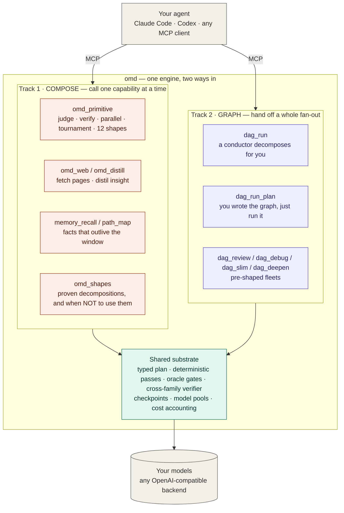
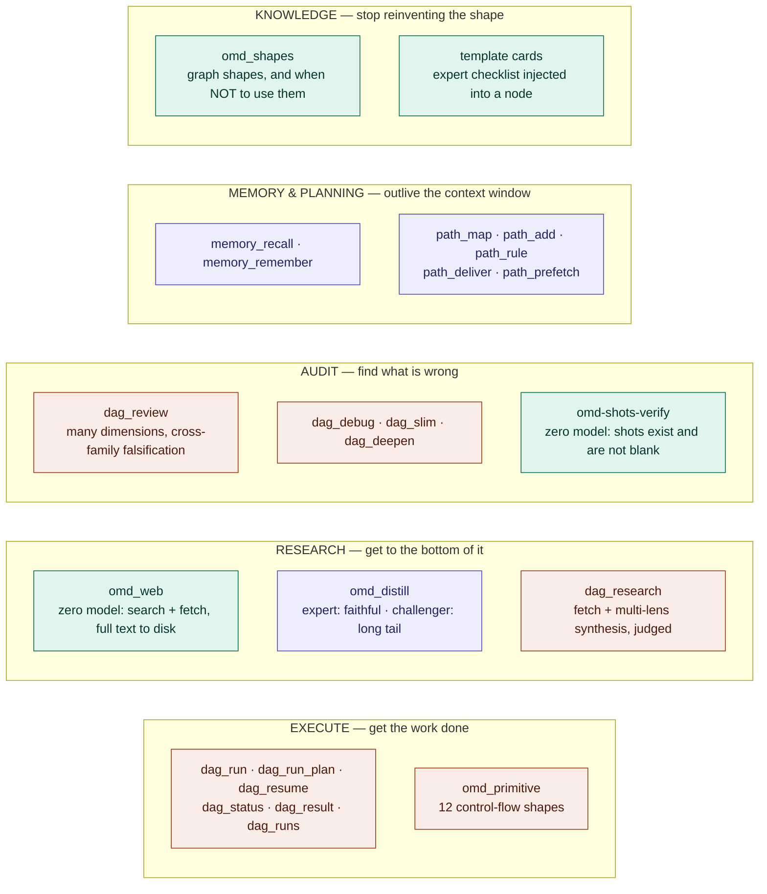
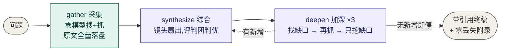
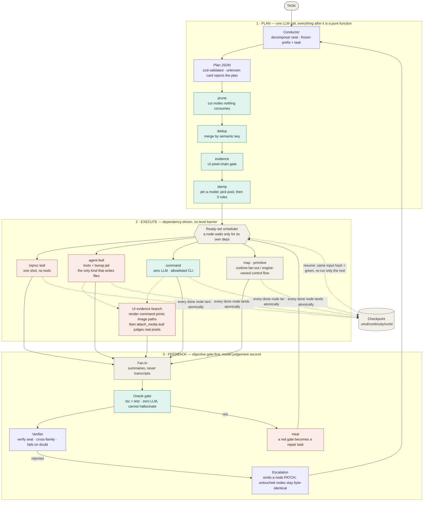
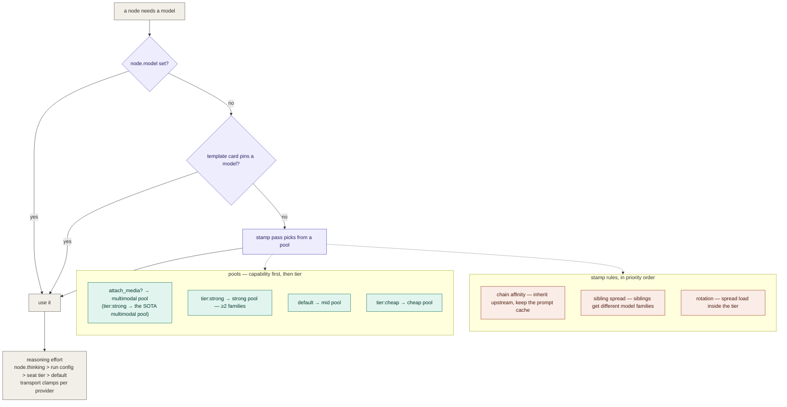

<div align="center">

# oh-my-dag

### 两条路把便宜的并发模型接到你的 agent 后面 —— 调一个能力,或者把整张图交出去。

*你的 agent 继续当脑子。omd 提供双手、闸门和记忆。*

[](docs/mcp-tools.md)
[](client-skills/)
[](docs/model-layer.md)
[](https://bun.sh)
[](LICENSE)

[English](README.md) · **中文** · **[上手 →](docs/MCP-ONBOARDING.md)**

</div>

## 两条主线

你的 coding agent 是一个强而贵的脑子。让它逐字敲文件、逐页读资料、把所有计划都装在脑子里,
是把屋里最聪明的东西用在了最不该用的地方。

omd 给它两条派活的路,而且**两条共用同一个底座** —— 换轨道不换可靠性:



**主线一 · 组合** —— 调一个能力,看一眼结果:让 `judge` 在三个尝试里挑最优、抓一篇文章蒸出洞察、
召回上周定过什么。二到五步,你全程在场。

**主线二 · 图** —— 把整片扇出交出去:任务变成带类型的节点,节点在自己的依赖就绪那一刻就跑,
每个节点都有 checkpoint,断掉的 run 是续跑不是重来。十个节点还是一百个,你可以去干别的。

分界线是**规模**,而调用方最擅长判断规模。让图值回票价的那四个确定性 pass(剪枝/去重/证据闸/
钉模型)在 3 步组合里一分钱不值,在 40 节点扇出里是命根子。

## 快速上手

```bash
git clone https://github.com/AbyssCN/oh-my-dag.git && cd oh-my-dag
bun install && bun link      # 把 `omd` 放上 PATH (Bun ≥ 1.3)
omd init                     # 向导:密钥、模型预设、可达性探测 → .env
```

```bash
cd <你的项目> && claude mcp add omd -- omd mcp
```

斜杠命令包(`/omd-path`、`/omd-review` 等 20 个 skill)在 server 首次启动时自动装进
`~/.claude/skills/` —— 幂等,且**绝不覆盖你改过的 skill**。`OMD_INSTALL_SKILLS=0` 可关。

**→ [完整走查](docs/MCP-ONBOARDING.md)** · [命令参考](client-skills/README.md)

<details>
<summary>怎么配后端</summary>

跑 `bun run init` 进交互向导,或自己在 `.env` 里配 `OMD_RUNTIME_PROVIDER` +
`OMD_RUNTIME_MODEL` + 后端密钥(抄 [.env.example](.env.example))。

**没有终端 UI 了。** omd 曾自带一个交互 agent,2026-08-01 撤除 —— 引擎只留一个正门。
你的 MCP 客户端**就是**前端:对话在那边,omd 只管执行。

</details>

## 能有哪些能力可调



**执行** —— `dag_run`(conductor 替你分解)· `dag_run_plan`(图你自己写好了)· `dag_resume`
(从断掉的地方接着跑)· `omd_primitive`(单跑一个控制流形状,不必先有图)· `dag_status` /
`dag_result` / `dag_node_output` / `dag_runs`。

**研究** —— `omd_web`(搜 + 抓,**零 LLM**;全文落盘,只回索引)· `omd_distill`(对你已有的
文本跑两个镜头:一个忠实,一个对抗)· `dag_research`(抓 + 多镜头综合 + 裁判团)。

**审查** —— `dag_review`(多维度 diff 审查,每个维度可路由到不同模型家族)· `dag_debug` ·
`dag_slim`(只删不加的过度工程审计)· `dag_deepen`(架构热点)。

**记忆与规划** —— `memory_recall` / `memory_remember` ·
`path_map` / `path_add` / `path_rule` / `path_deliver` / `path_prefetch`(一张进 git 的决策地图,
用带类型的票推进,后台调研在你关掉客户端之后继续跑)。

**知识** —— `omd_shapes`(经验证的图式,每条都带触发条件**和"什么时候别用"**)·
模板卡(执行期把专家检查单注入节点)。

**配置** —— `omd_config_status` / `omd_set_model` / `omd_set_role` / `omd_apply_preset` / …

**→ [完整工具参考](docs/mcp-tools.md)**

## Deep research —— 拿真数字量过

一条命令把问题扇给一群便宜的并发模型:零丢失地把每个来源抓到盘上,用互相竞争的镜头综合,靠再抓补自己的
缺口,最后让评判团挑出冠军。

```bash
bun run scripts/dag-research.ts "<你的问题>" --deep
```

我们拿它和一套全强模型的方案在同一道题上对跑(MCP 生态 2026 年中盘点)。**System A** —— omd `--deep`
跑便宜座位;**System B** —— 106 个 agent 的 Claude workflow,每个 agent 都是强模型。

| | **A · omd `--deep`** | **B · 106-agent 强模型 workflow** |
|---|---|---|
| 现金成本 | **$2.19** | 订阅额度 · 3.76M token |
| 产出 | 132k 字终稿 · 32 个来源 | 23 条断言,3 票全票核实 |
| 代价 | 干净跑完 | 撞限额没跑完 |

> **便宜栈用 $2.19 再现了强模型 workflow 核实过的 15 条事实里的 13 条。**

不是因为小模型偷偷有强模型的水平,而是因为 deep research 有一层**确定性的检索地板**:`omd_web` 抓取全程
不带模型,原文全量落盘,缺口靠**再抓那个缺的来源**补上,而不是让模型凭记忆填。模型只管综合,检索交给引擎。
这就是整个仓库那句话在一道题上的实测 —— *可靠性来自模型之外*。



**→ [原理、模型分配、完整 A/B 对比](docs/deep-research.md)** ·
[样例输出](docs/examples/deep-research-mcp-2026.md)

## 图是怎么跑的

一个任务由 LLM **规划一次**,然后交给**纯函数**变换,再按依赖顺序执行。conductor 之后的一切
都是确定性的。



*紫 = 烧 LLM · 青 = 确定性零 LLM · 橙 = 执行体 · 灰 = 引擎结构件。*

**节点种类** —— 一个节点可以是什么:

| 种类 | 有模型? | 有工具? | 用于 |
|---|---|---|---|
| `leaf` | 单发一次 | 无 | 生成、研究、判断、起草 |
| `agent` | 有 | read/edit/write/bash,关在 bwrap jail 里 | **唯一能写文件的种类** |
| `command` | **无** | 白名单内的 CLI | 闸(`tsc`/测试)、扫描器、索引查询 |
| `map` | 混合 | — | 运行时扇出:lister 跑出工作清单,每个元素一个子节点 |
| `primitive` | 混合 | — | 12 种由引擎持有的控制流形状 |

**Plan pass** —— 计划与执行之间的纯函数:`prune`(剪死节点)→ `dedup`(语义指纹归并)→
`evidence`(UI 像素证据链闸)→ `stamp`(给每个节点钉模型)。

**控制流原语** —— 你只挑形状和参数;循环 / 分支 / 停止 / 打分的逻辑归运行时,永远不归模型:
`parallel` · `pipeline` · `loop-until` · `verify` · `judge` · `discovery` · `iterate` ·
`tournament` · `router` · `race` · `escalation` · `saga`。

**→ [架构详解](docs/architecture.md)** · [原语](docs/primitives.md) ·
[图的真理源](docs/diagrams/01-engine-flow.md)

## 哪个模型跑哪个节点



两件事刻意分得很开:**卡(card)说"怎么做"** —— 方法论、检查单、输出纪律;**座位与池说
"谁来做"** —— 模型坐标。二者自由组合:同一张卡能跑在任何模型上,同一个模型能执行任何卡。
这是它与 subagent 最大的结构差别 —— subagent 把这两件事焊死在一个定义里。

**→ [模型层详解](docs/model-layer.md)** · [图的真理源](docs/diagrams/04-model-layer.md)

## 为什么它立得住

一条原则的两半。只讲第一半的系统会把模型机械化掉;只讲第二半的系统会在无法核验的地方信任它。

> **可靠性来自模型之外。** 闸管**判定** —— 做完没有、存不存在、过不过?确定性、零模型、
> fail-closed。模型"看一眼"不算闸:它静默地没跑时,没有任何东西会变红。
>
> **创造力来自模型之内。** 模型管**生成** —— 做什么、怎么做、还缺什么。闸内不要用规则替代它。
> 用机械规则替代生成,就是把前沿模型的智商折价成那条规则的表达力。

三条推论(它们才是能决定具体设计的部分):

1. **确定性探测器是下限,不是上限。** 它保证明显的漏不漏,但绝不能成为"唯一被允许发现问题的东西"。
2. **终止归引擎,内容归模型。** 轮数与 quorum 由引擎计数;问模型"够了吗"等于把闸要消除的
   静默失败又请回来。
3. **闸在接缝上,不在每一步。** 把有能力的模型当有能力的人:代价高的地方检查,它想的时候别盯着看。

## 设计准则

- **契约优先于散文。** 每个接缝都是带类型的 schema;校验不过的 plan 根本不会跑。
- **边界 fail closed,记账 fail open。** 未知的卡名直接拒 plan;checkpoint 写不下去只 warn。
- **不许静默成功。** 声称产出文件却盘上没有 = 失败,不是可以信任的自述。声称"审过"却根本
  不存在的截图同理。
- **跨家族才算数。** 与作者同家族的校验者共享它的盲点;同家族的三个研究镜头也一样。

## 文档

| | |
|---|---|
| [架构](docs/architecture.md) | pass 管线、调度、故障边界、checkpoint 与续跑 |
| [原语](docs/primitives.md) | 12 个控制流形状,以及什么时候该用普通节点 |
| [模型层](docs/model-layer.md) | 座位、池、stamp 规则、推理档、多视角审查 |
| [MCP 工具](docs/mcp-tools.md) | 全部 33 个,分组 |
| [记忆](docs/memory.md) | 事实库、混合召回 |
| [图](docs/diagrams/) | 上面每张图的 Mermaid 真理源 |

## 许可

MIT —— 见 [LICENSE](LICENSE)。
