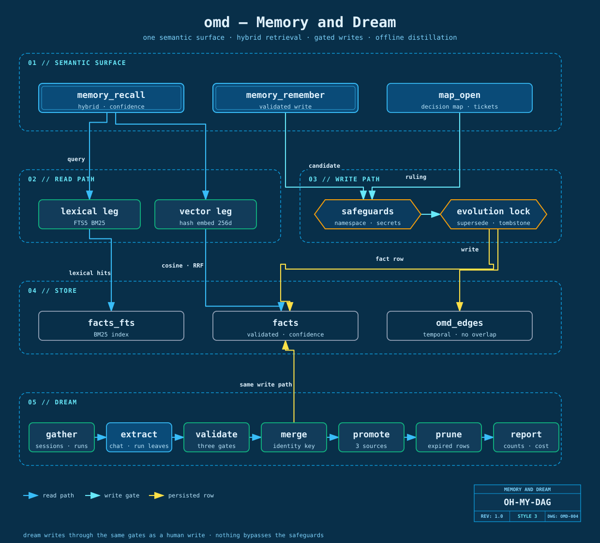

# Memory and dream — what is known, and how it got there

[← architecture overview](overview.md) · [dag engine](dag-engine.md) ·
[MCP tools](../guide/mcp-tools.md) · [workflow](../guide/workflow.md)



Two halves that are easy to confuse. The **memory layer** is a store you can query at any moment:
facts, time-bounded edges between them, and a hybrid retrieval that costs nothing per call. The
**dream pipeline** is the thing that fills it: a fixed graph that reads finished sessions and
finished runs, distils candidate facts, and refuses most of them.

They are separable on purpose. Recall works whether or not dream has ever run; dream is the only
automatic writer, and every gate below exists because an automatic writer that is trusted becomes
a fact store nobody can trust.

---

# Part 1 — the memory layer

One SQLite file per project. The path is `OMD_MEMORY_PATH ?? .omd/memory.db`, resolved in exactly
one place (`src/harness/memory/db-path.ts`) so that every writer — the store, the watermark table,
the MCP server's default memory — lands in the same file.

## The two fact tools

Both live in `src/mcp/tools/memory.ts` and close over one injected `OmdMemory`.

| Tool | Signature | Behaviour |
|---|---|---|
| `memory_recall` | `query`, `k` (default 10, hard cap 50) | hybrid retrieve; one ranked line per hit carrying namespace, confidence, source and RRF score next to the text. Nothing matched returns the literal `No matching facts found.` |
| `memory_remember` | `fact` (must carry `namespace`, `confidence`, and one of `source_event_id` / `source_doc_id`) | goes through the same write floor as everything else; `OK id=… action=…` on success, `REJECTED: <reason>` on refusal, with `[BANNED]` prefixed when the namespace itself was the problem |

The refusal wording is split for a reason: "your fact was malformed" and "this whole namespace is
off limits" call for different fixes. And an explicit `memory_remember` runs with
`scanSecrets: false` — you have sovereignty over your own store. Dream does not (see below).

## Retrieval — two legs, fused

`src/harness/memory/store.ts`. A query runs down two independent legs and the ranks are fused by
Reciprocal Rank Fusion with `RRF_K = 60`:

| Leg | Implementation | Answers |
|---|---|---|
| lexical | SQLite FTS5, real `bm25()` over a `facts_fts` virtual table | "this exact term appears" |
| vector | brute-force cosine over stored embeddings | "these words travel together" |

A Tier-1 store holds well under ten thousand facts, so brute force is the correct algorithm:
exact, fast, and with no ANN index to tune or rebuild. RRF also degrades gracefully — a query
that only one leg understands still ranks sensibly.

**The default vector leg is deterministic, not semantic**, and that is worth knowing before you
budget for it. `defaultEmbed` is `hashEmbed` (`src/harness/memory/embed.ts`): a 256-dimension
hashed bag-of-tokens projection with zero network calls, zero API keys, and reproducible output
in tests. It makes co-occurring vocabulary cluster without pretending to model meaning, and the
BM25 leg carries most of the weight regardless. Real semantic recall means injecting a different
`EmbedFn` at store construction; until you do, both tools cost nothing per call.

## Namespaces are a closed list

Nine facets under the universal safeguard (`src/memory/safeguards/universal-namespaces.ts`).
Anything else is refused at the door. A closed vocabulary is what makes the per-namespace
**identity key** — and therefore supersession — well defined; an open one would turn every
near-duplicate into a new fact.

| Namespace | Identity key |
|---|---|
| `user.preference` | `category` |
| `user.interest` | `topic` |
| `user.focus` | `focus` |
| `user.expertise` | `domain` |
| `user.trait` | `category` |
| `user.goal` | `goal` |
| `omd.capability` | `area` |
| `omd.pattern` | `situation` + `approach` + `scope` |
| `omd.limit` | `kind` + `statement` |

`omd.pattern` carries `scope` inside its identity, drawn from a controlled vocabulary
(`OMD_PATTERN_SCOPES` = `chat-correction` · `plan-family` · `oracle` · `seat`). Free text in an
identity key would mean two facts about the same situation almost never collide, and supersession
would stop happening at all — which is the failure mode of an accreting store rather than a
sharpening one.

## The write path

Every write passes `validateFactWrite`: out-of-namespace, banned, schema-invalid, missing source
anchor, invalid confidence — five refusals, one vocabulary, no per-caller variants. A confidence
self-evolve lock decides whether a new fact of the same identity supersedes the existing one.

Supersession is never an in-place `UPDATE`. The old row is **tombstoned** (soft-deleted, payload
retained) and a new live row is inserted. That choice pays for itself twice: `human_verified`
facts cannot be tombstoned at all (a shrink invariant), and the tombstoned history *is* the
evidence ledger — `collectIdentityEvidence(namespace, identityKey)` reads the union of
`source_event_ids` across every row, live and dead, for one identity. Cross-session evidence
needs no new table because deletion was never destructive.

## Temporal edges

Facts are linked by time-bounded edges (`src/harness/memory/edge-store.ts`) over half-open
intervals `[validFrom, validTo)`, with a no-overlap invariant (EDGE-INV-1) enforced by the
application. "What was true when" is therefore a query, not an inference from timestamps.

The only legal mutation is `invalidate(identity, at, successor)`: it closes the currently open
edge at `at` and inserts the successor starting there. There is no `put`-over-the-top path,
because that would leave a residual open edge overlapping its own replacement, and the overlap —
not the wrong answer — is what makes the store un-queryable afterwards.

## Facts versus decision maps

Facts are what you learned. A **decision map** is what you still have to decide, and it is a
different store with a different shape — tickets on disk, a frontier computed from their
dependency edges, rulings accumulating across sessions
([workflow.md](../guide/workflow.md) has the loop).

The two touch at exactly one point: a landed ruling also writes an `omd.pattern` fact through the
same `OmdMemory`, so `memory_recall` can surface it later. That write is a bonus, not a link in
the chain — if it fails it warns and moves on, because the decision is already on disk.

---

# Part 2 — dream, the distillation pipeline

`src/harness/dream/`. The graph is fixed, and its shape is the point: **two model nodes, six
deterministic ones.**

| Stage | File | Model? | In | Out |
|---|---|---|---|---|
| gather | `gather.ts` | no | chat sessions + finished runs | a per-source dirty report with candidate cursors |
| extract-chat × N | `extract-chat.ts` | **yes**, parallel | one dirty session's raw entries | `DreamCandidate[]` |
| extract-run × M | `extract-run.ts` | **yes**, parallel | one finished run + its plan-ledger row | `DreamCandidate[]` + temporal edge ops |
| validate | `validate.ts` | no | each candidate | `written` or `rejected: <reason>` |
| merge | `merge.ts` | no | accepted candidates | insert / evolve / replace counts |
| promote | `promote.ts` | no | live tentative facts | promotions to `agent_confident` |
| prune | `promote.ts` | no | the store + a clock | expired tentative tombstones |
| report | `report.ts` | no | every stage's report | one printable run record |

Orchestration lives in `assembly.ts`, which is itself zero-LLM. Accounting has a single exit: the
gateway `callModel` already emits usage, so no layer inside dream emits it again — double-counting
was found in acceptance and the rule is now stated at the top of the file.

## Corpus collection, and the watermark

Two sources, each with a sharp edge:

- **Chat sessions** are read through `entries()`, not `messages()`. The latter is the projection
  `buildSessionContext` builds, and it truncates originals before the compaction point.
- **Finished runs** means terminal status (`done` / `failed` / `cancelled`) **plus** `running`
  rows whose `ownerPid` is dead or absent. Omitting the second clause loses interrupted runs
  permanently, which was measured, not theorised.

Progress is tracked in a `dream_watermark` table inside the same `memory.db`. Its three states are
expressed by **columns, not magic values** — an absent row, a clean row, a dirty row and an
explicitly skipped row (with its reason) are four distinguishable things, and flattening any pair
of them makes "we never looked" indistinguishable from "we looked and found nothing".

Run watermarks are keyed **per run** (`run:<id>`), not by one global cursor. A single cursor sinks
any run that was still alive when the cursor passed it and died afterwards — that corpus never
becomes reachable again, and nothing reports the loss.

Two rules about advancing it:

| Rule | Why |
|---|---|
| `gather` computes a candidate cursor but never advances it | advancing at collection time means a crash mid-extract buries that batch forever |
| `assembly` advances it only after `merge.ok && promote.ok`, and only for the sources this run actually consumed | a failed run re-reads and re-burns next time; idempotency is carried by the identity key, so re-burning costs money, not data |

Skips are re-evaluated every time rather than being sticky: the active-session exclusion is a
statement about right now, and a sticky skip would mean a session that was busy yesterday never
enters the corpus after it retires.

## The two model nodes

Both resolve their coordinates the same way — `opts.model`, else `OMD_DREAM_MODEL`, else a loud
throw. There is no fallback coordinate, because a silent fallback turns "misconfigured" into
"quietly ran on the wrong seat".

**extract-chat** has two candidate sources. One is mechanical and needs no model: a user message
starting with the `[纠错]` prefix is parsed by a frozen regex into four parts and emitted as
**two** `omd.pattern` candidates with the same situation — one `outcome: 'failed'` for what was
done and one `outcome: 'worked'` for what should have been. Their approaches differ, so their
identities differ, so they coexist rather than superseding each other. The other source is the
model, and its response schema admits **only** `{ seq, namespace, payload }` — `sessionRef` and
`confidence` are attached by code afterwards. A model that could author its own provenance could
author provenance that points nowhere.

The trusted input rendered for the model is narrow by construction: explicit user statements and
our own measured readings. Tool calls and tool results do not enter it, and fetched web content is
untrusted by default. That is a weak boundary and is documented as one — the strong line is
`validate`.

**extract-run** produces four kinds of output from a finished run's transcript, redraw-feedback
blocks, invalid classification, and its plan-ledger family row: plan-family lessons and oracle
lessons (both `omd.pattern`, both required to carry `runId` + `nodeId`), seat lessons
(`omd.limit`, `kind: boundary`), and **temporal edges** — which are not facts at all and go
straight to the `EdgeStore` via `invalidate`.

## The gates

Everything after the two model nodes is a refusal mechanism.

**validate — three layers, fixed order** (`validate.ts`):

| Layer | Rejects | Note |
|---|---|---|
| the existing floor | malformed · banned · secret · schema · no-source-anchor · invalid confidence | `validateFactWrite(..., { scanSecrets: true })` — reused verbatim, verdict text passed through unchanged. `scanSecrets` is **true** here: dream is the automatic learning path, not the user, and the sovereignty exemption does not extend to it |
| scope | an `omd.pattern` candidate without a controlled `scope` | an identity key resting on free text means supersession structurally stops working |
| statistical assertion | any string leaf matching one of four frozen regexes (`N 次`, `$N`, `N%`, 平均/总计/合计) | a statistic written as a fact is a copy of a ledger that will be wrong tomorrow |
| provenance | a `sessionRef` whose session or `seq` does not resolve; a `runRef` whose run is not in `runs.db` | "it can point back" is checked by pointing back |

`dreamFactInput` is the **single construction point** for the fact object. Validate checks it and
merge writes it, so the gate cannot pass one shape while a different one goes to disk.

**merge — budgets are pre-checks, not truncation** (`merge.ts`): `K_leaf = 8` candidates per leaf
and `K_run = 30` per run are evaluated *before the store is even opened*. Exceeding either fails
the whole run with **zero writes**. The first implementation wrote everything and then set an
`ok: false` flag, which is worse than truncation: the side effects all landed and the failure was
decoration.

**assembly — batch budgets** (`assembly.ts`): `L_MAX = 12` model leaves and `COST_MAX_USD = 0.10`
per run. Exceeding either fails loudly with the actual value and the limit in the verdict, and
never degrades silently. For a backlog first run there is `--batch <n>`: consume at most *n*
dirty sources this pass, leave the rest of the cursors untouched, and let the watermark advance
one segment at a time.

**promote — two conditions, both required** (`promote.ts`): evidence count `≥ N_repro = 3`, and
that evidence must come from `≥ N_sessions = 2` **distinct sources**. The first number is not a
judgement call — the schema for `agent_confident.source_event_ids` enforces a minimum of 3. The
second exists because three mentions inside one conversation is one person repeating themselves,
not a reproduction across contexts; source attribution parses the frozen anchor formats
(`session:<id>:seq:<n>` → `session:<id>`, `run:<id>[:node:<x>]` → `run:<id>`) in a named pure
function with its own tests. Anything unparseable does not count toward the second condition.

Promotion writes a fact with the same identity and `level: 'agent_confident'` — a **string
literal in the type**, so `human_verified` is not merely discouraged from the dream path, it is
unreachable from it.

## The report

Both sides get written. `report.ts` prints added / evolved / replaced / promoted / pruned / NOOP,
the dirty totals, LLM calls and cost, and rejections **grouped by reason prefix** — without the
grouping, "the gates are too tight" and "the model is too wild" produce the same number.

Three columns are tri-state (`never-extracted` / `extracted-then-pruned` / `not-applicable`) and
print as literal `NULL` when unmeasured. NULL is not 0 and neither is "does not apply"; inventing
a zero for an unmeasured column destroys the distinction permanently.

## How it is triggered

Manually, through one CLI, and that is the whole trigger surface today:

```bash
bun run scripts/omd-dream.ts all --batch 12 --model <provider:model>
```

| Phase | Does |
|---|---|
| `gather` | S1 collection only, zero LLM — prints the per-source dirty report |
| `validate` / `merge` | zero LLM, candidates read as JSON from stdin |
| `promote` | promotion + prune, zero LLM |
| `report` | current gather state |
| `all` | the whole graph through `runDreamAssembly` |

Flags: `--run <id>` · `--cwd <dir>` · `--model <provider:model>` · `--json` · `--dry-run`
(omits `callModel`, so no leaf burns and no cursor advances) · `--batch <n>`. A failed run exits
non-zero.

There is **no MCP tool and no scheduler.** Nothing on disk runs dream on a timer, a hook, or a
session boundary — cadence is whoever types the command. The threshold constants in `gather.ts`
(`M = 20` new entries, `W_HOURS = 6`, `W_SESSIONS = 2`) are exported and marked tentative, but
nothing currently reads them; they describe an intended trigger policy that is not wired to one.

## Session handoff — the third memory surface

Between windows, a session is distilled into a checkpoint the next one reads, so a fresh
window opens knowing what the last one decided instead of re-deriving it. The distiller
([`src/harness/session/writer.ts`](../../src/harness/session/writer.ts), driven by
[`scripts/session-writer.ts`](../../scripts/session-writer.ts)) reads the transcript from the
last offset, writes a segment-budgeted checkpoint, and then runs a **zero-LLM verification
gate** over it: structure, referenced file paths that must exist, commit hashes that must
be in `git`. Fail it and the checkpoint is rewritten once, then mechanically degraded.

The whole path is fail-open — a broken distillation still yields the degraded checkpoint
and never blocks the caller. That is deliberate: this runs on the way out of a session, and
a handoff writer that can fail the session is worse than no handoff writer.

## Where the code lives

| Concern | Path |
|---|---|
| fact store · hybrid retrieval · tombstone · evidence ledger | `src/harness/memory/store.ts` |
| deterministic embedder | `src/harness/memory/embed.ts` |
| temporal edges (no-overlap) | `src/harness/memory/edge-store.ts` |
| db path resolution (one place) | `src/harness/memory/db-path.ts` |
| namespaces · identity keys · write floor | `src/memory/safeguards/` |
| MCP fact tools | `src/mcp/tools/memory.ts` |
| dream orchestration + budget gates | `src/harness/dream/assembly.ts` |
| corpus + watermark | `src/harness/dream/{gather,watermark}.ts` |
| model leaves | `src/harness/dream/{extract-chat,extract-run}.ts` |
| refusal · write · promotion · report | `src/harness/dream/{validate,merge,promote,report}.ts` |
| manual CLI | `scripts/omd-dream.ts` |
