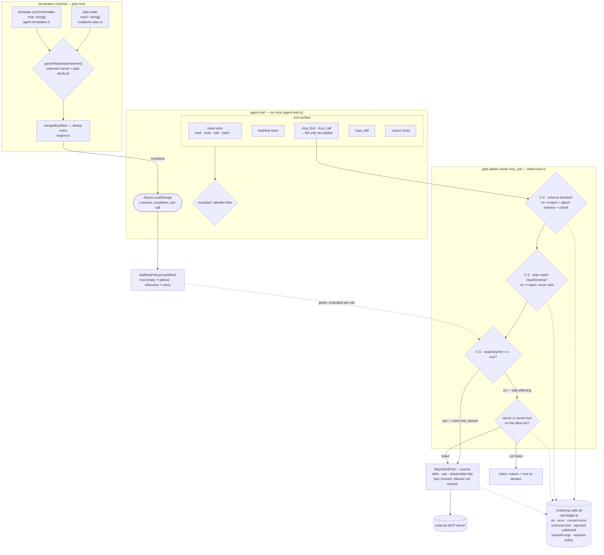

# Open ecosystem — external MCP servers inside omd

[← README](../../README.md) · [architecture overview](overview.md) · [MCP tools](../guide/mcp-tools.md) · [TUI](../guide/tui.md)

omd is an MCP **server**. This is the other half: omd as an MCP **client**, so any
ecosystem server you already run under Claude Code or another host becomes callable from
inside omd — from the chat seat *and* from a DAG leaf, on the same footing.

Two properties make that safe to do at fan-out scale:

- external tools **never enter the tool array**, so registering a server does not move a
  single byte of the frozen prompt prefix;
- side effects at a leaf require a **declaration in the plan**, and the check is a gate in
  code, not a sentence in a prompt.

## 1. The deferred proxy shape

A naive client injects each external server's tools into the agent's tool array. omd does
not, for a measured reason.

Prompt caching is **byte-exact prefix matching**, in the order tool definitions → system
prompt → messages. Tool definitions sit at the very front. One differing byte at position
N invalidates every cache breakpoint after N — so installing one new MCP server would
blow away the whole prefix, including the system prompt behind it. The same trap was hit
once already with skills: an early `read_skill` embedded a disk-scanned group summary
(`lark(26) · omd(21) · …`) in its `promptSnippet`, and installing any skill invalidated
the prefix. The write-up lives in `src/harness/skills/skill-tool.ts`.

So `createMcpClientTools` (`src/mcp/client/meta-tools.ts`) returns a **constant surface of
exactly two tools** with frozen schemas:

| Tool | Execution mode | Job |
|---|---|---|
| `mcp_find` | `parallel` | list servers / search tools / return one tool's full schema |
| `mcp_call` | `sequential` | invoke `server:tool` with arguments |

Everything dynamic — how many servers, which tools, what their schemas are — travels in
**tool return values**. Messages are append-only, so they never invalidate the prefix.
Sequential mode on `mcp_call` matches `write` and `bash`: an external tool's side effects
are unknown.

The count of external tools is therefore fully decoupled from the size of the prompt
prefix, and within a run the tool array and system prompt stay byte-stable.

### Zero registration means zero change

`createMcpClientTools` returns `[]` when there is no registry and no config error. The
two meta-tools are spread into the tool list, so an empty array leaves the tool surface
and the prompt prefix **byte-identical to before the feature existed**. This mirrors the
existing rule for skills and codegraph: a tool that is guaranteed to fail is worse than
no tool. It is also what makes the baseline provable — `src/tui/tools/chat-seat.test.ts`
and `src/harness/agent-leaf-sdk.test.ts` both assert it from opposite ends.

A **broken** registry is the one exception: malformed JSON still mounts the two tools and
surfaces the parse error through `mcp_find`'s return value. An empty table would let the
user read "I mis-typed the config" as "this mechanism does not exist here".

## 2. Shape of a leaf's tool surface



## 3. Registration

The source of truth is `<cwd>/.omd/mcp.json`, in the ecosystem-standard shape so existing
configs move over unedited:

```json
{ "mcpServers": { "<name>": { "command": "...", "args": [], "env": {} } } }
```

`src/mcp/client/config.ts` accepts `command` / `args` / `env` / `url` / `headers` /
`type` / `disabled` / `connectTimeoutMs` / `callTimeoutMs`.

| Situation | Behaviour |
|---|---|
| explicit `type` | wins; an unrecognised value warns and skips that server |
| no `type`, has `url` | remote transport |
| no `type`, has `command` | stdio |
| neither | warn, skip that entry — the rest of the table still loads |
| `disabled: true` | skipped |
| file absent | `{ servers: [] }` and **no** `loadError` — not registered is not an error |
| malformed JSON | `{ servers: [], loadError }`, warned, and surfaced through `mcp_find` |

The project-root `.mcp.json` (Claude Code's file) is read **only** when `.omd/mcp.json`
sets `"importClaudeConfig": true`; the default is off, and no code path ever writes it.
When importing, same-named entries in `.omd/mcp.json` win, and a broken `.mcp.json` only
warns rather than taking the omd table down with it.

`knownMcpServerNames(cwd)` is the single export the plan validator uses — see §6.

## 4. Connection pool

`src/mcp/client/pool.ts` wraps the official `@modelcontextprotocol/sdk` clients for the
three transports: stdio, SSE, and streamable HTTP.

**Connection is lazy.** Assembly connects to nothing; the first `mcp_find` or `mcp_call`
opens the connection, and the client plus its tool list are then cached for the process
lifetime. Agent leaves are in-process runners, so a wide fan-out must not spawn N child
processes per leaf.

**Failure is not cached.** A rejected connection promise is deleted from the map, so the
next call retries, and the error text propagates to the caller verbatim — the pool fails
open on the tool path but never swallows the evidence. `listAll()` returns
`{ tools, errors }` so a partially reachable registry is still usable and the unreachable
part is still visible.

For stdio, the child environment is merged explicitly as
`{ ...getDefaultEnvironment(), ...entry.env }`, because the SDK *replaces* rather than
merges env — without the merge the child has no `PATH`.

Non-text content blocks are rendered as `[non-text content: <type>]` rather than dropped.

## 5. The gate ladder

`mcp_call` runs four checks in order. Each rejection is deterministic, is written to the
ledger under its own status, and never reaches the server.

**Schema must be fetched first.** Calling a tool whose schema was never retrieved is
rejected — and the rejection *is* the disclosure: it returns the full schema and marks
the tool as fetched, so resending immediately succeeds. This is a **teaching failure**,
not a wall. It exists because the repo's own measurement says a rule written into a
prompt does not stop the behaviour; a gate does.

**Arguments are validated before the wire.** The tool's `inputSchema` is checked and the
first few violations are returned as `path: message`. A schema outside the validator's
covered subset makes validation **fail open** with a warning — external servers may use
JSON Schema features omd's validator does not cover, and refusing them all would be
worse than letting them through.

**Read-only passes; side effects need authorization.** A tool whose `readOnlyHint` is
exactly `true` passes regardless of policy. Otherwise the policy applies:

| Policy | Meaning |
|---|---|
| `'allow'` (default) | everything passes — this is what the chat seat gets |
| `{ allow: [...] }` | pass only if the list contains the bare server name **or** the fully-qualified `server:tool` |
| `'deny'` | nothing side-effecting passes |

A policy rejection returns two things: the reason (which tool, why it counts as
side-effecting, what the current policy is) **and** how to declare authorization. Both go
into the return value and the ledger's `error` column — deliberately not into
`promptSnippet` or `description`, which must stay static.

## 6. Declaration channel

The leaf's allow-list is not configuration; it is part of the plan, and it is validated
when the plan is parsed.

| Piece | Where | Note |
|---|---|---|
| `mcp?: string[]` on a plan node | `src/harness/conductor-plan.ts` | entries are `server` or `server:tool`; advertised in the conductor's schema block |
| `mcp` in template card frontmatter | `src/harness/agent-templates.ts` | type-filtered at load, fail-open: a malformed field is dropped with a warning and the card still loads |
| `mergeMcpAllow(node, tpl)` | `src/harness/conductor-plan.ts` | dedup union of the two — one function, one definition; called from `src/harness/dag/engine.ts` |
| `knownServers` on `parsePlan` | `src/harness/conductor-plan.ts` | **mandatory parameter** |
| `mcp` in the semantic key | `src/harness/plan-passes/semantic-key.ts` | dedup must not merge nodes with different authorization |
| `mcp` in the field registry | `src/harness/schema-field-registry.ts` | declares its consumer, so it cannot become an empty knob |

Two of those deserve the reason spelled out.

`knownServers` is **required**, not optional, specifically so there is no "omit it and
validation silently does not happen" path. Declaring a server that is not registered
invalidates the whole plan at parse time, with the unknown name in the error — the same
treatment an unknown template gets. The engine reads the set from that run's own working
directory (`mcpRegistryRoot(config)` in `src/harness/dag/engine.ts`, falling back to
`process.cwd()`), so the check is against the registry that will actually be used.

`node.mcp` enters the **semantic key** because a different authorization list means a
different set of callable external tools, which means a different execution. Merging two
such nodes during dedup would silently swallow one side's tool surface.

At run time the union reaches the leaf as `mcpAllow`. An empty union is not passed at all,
and `leafMcpPolicy` maps a missing or empty list to `'deny'`:

```ts
export function leafMcpPolicy(mcpAllow?: string[]): { sideEffects: { allow: string[] } | 'deny' } {
  return mcpAllow && mcpAllow.length > 0 ? { sideEffects: { allow: mcpAllow } } : { sideEffects: 'deny' };
}
```

That is the whole rule, in one place. **A leaf that declares nothing is authorized for
nothing** — the chat seat's `'allow'` default does not propagate downward.

### Why an AsyncLocalStorage

A leaf runner is built once and reused across runs and nodes, but `mcpAllow` is only
knowable per call. It therefore cannot be baked into the assembly closure: the closure
installs a **getter**, and the runner writes `{ session, mcpAllow }` into an
`AsyncLocalStorage` per call. `run()` rather than `enterWith()` — the latter mutates the
*caller's* context, which here is the engine's, so concurrent nodes would overwrite one
another.

The policy is passed as a function, so it is evaluated at each `mcp_call` rather than
captured once.

## 7. The leaf has the same rights as the chat seat

There is no second, restricted client implementation for leaves. The same
`createMcpClientTools` factory is called at both seats — `src/tui/tools/chat-seat.ts` and
`src/harness/agent-leaf.ts` — producing the same two meta-tools, the same gates, the same
pool, and the same ledger.

The **only** difference is a parameter: the chat seat passes no `policy` and therefore
gets the `'allow'` default; the leaf passes `policy: () => leafMcpPolicy(...)`. Read-only
tools pass at both.

The reasoning is that omd is a standalone agent and the TUI is only one of its shapes, so
external MCP, skills, and extensions cannot be chat-seat-exclusive. The residual risk
specific to leaves is wide fan-out multiplied by side effects — which is turned into a
gate rather than into a restriction on the direction.

The same move was made for skills: the `read_skill` factory was lifted out of the TUI
layer into `src/harness/skills/skill-tool.ts` and mounted in leaf assembly, with
`src/tui/tools/skill-tool.ts` left as a re-export shim so there is one definition.
`read_skill` is itself an umbrella tool of the same deferred shape — one tool, with the
skill catalogue travelling in return values.

Over the Claude subscription channel the meta-tools cross the existing in-process bridge
automatically and appear as `mcp__omd__mcp_find` / `mcp__omd__mcp_call`, so both channels
share one policy, one ledger, and one audit surface.

## 8. Call ledger

Every call is recorded in `<root>/.omd/mcp-calls.db` (`src/mcp/client/call-ledger.ts`,
bun:sqlite, WAL). The ledger is opened lazily on the first record, so a find-only session
leaves no empty database behind, and a write failure warns rather than disturbing the tool
path.

| Status | Meaning |
|---|---|
| `ok` | reached the tool, tool succeeded |
| `error` | reached the tool, tool returned an error (text stored verbatim) |
| `connect-error` | never reached the tool |
| `unknown-tool` | the name did not resolve to a server |
| `rejected-unfetched` | schema had not been fetched |
| `rejected-args` | arguments failed the schema |
| `rejected-policy` | side-effecting and not authorized |

The four rejection categories are kept distinct on purpose. "It did not reach the server"
has four different causes, and flattening them into one label makes them permanently
indistinguishable. Columns follow the same discipline: `session` and `server` are `NULL`
when genuinely unknown, never `''`.

## 9. Gates

| Test | What it pins |
|---|---|
| `src/mcp/client/config.test.ts` | absent file → empty and no error; malformed JSON → `loadError` verbatim; `importClaudeConfig` off by default and read-only when on; one bad entry does not kill the table |
| `src/mcp/client/pool.test.ts` | a real stdio child process answers over the wire; an unreachable server lands in `errors` and is not cached; construction connects to nothing |
| `src/mcp/client/meta-tools.test.ts` | zero registration → `[]`; broken registry → still mounted with the error visible; `promptSnippet` contains no disk-scanned value; the three `mcp_find` branches; the fetch gate rejects then passes on resend; the arg gate names the field and the server sees zero calls; one ledger row per outcome |
| `src/mcp/client/meta-tools-policy.test.ts` | `deny` + side-effecting → rejected with reason and how-to-declare, ledger `rejected-policy`, **server call count zero**; `readOnlyHint` passes under `deny`; both allow-list forms; omitting `policy` reproduces prior behaviour; function-form policy re-evaluated per call |
| `src/harness/mcp-policy-wiring.test.ts` | the whole production chain: the union really arrives as `mcpAllow` and the tools really run; an undeclared node falls back to `deny` with zero server calls; an unregistered server is rejected at plan time and accepted once registered in the same cwd |
| `src/harness/agent-leaf-sdk.test.ts` | both meta-tools cross the SDK bridge and appear in `allowedTools`; zero registration → neither appears |
| `src/harness/conductor-plan.test.ts` | legal `mcp` parses (including inside a `map` sub-template); an unregistered server invalidates the plan and the error names it; an empty registry rejects any declaration |
| `src/harness/agent-templates.test.ts` | frontmatter `mcp` preserved when well-formed, dropped with a warning when not, absent as a missing property rather than `undefined` |
| `src/tui/tools/chat-seat.test.ts` | zero registration → tool surface unchanged; one registration → exactly two more tools, and external tools never enter the surface |
| `src/harness/mcp-schema-registry-regression.test.ts` | `mcp` enters the semantic key, blocks dedup of otherwise-identical nodes, and stays in sync with the field registry and its generated documentation |
| `src/harness/skills/compile.test.ts` | the `mcp__<server>` host-tool criterion queries the real registry instead of pattern-matching a marker |

Design records: `docs/plan/2026-08-10-omd-open-ecosystem-sdd.md` (S1) and
`docs/plan/2026-08-10-omd-open-ecosystem-s2-leaf-mcp-sdd.md` (S2).
