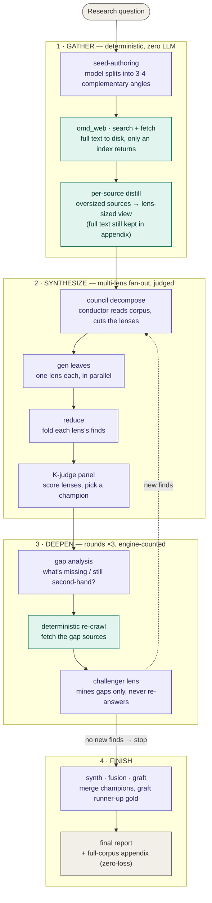

# Deep research

Fan out a research question across cheap concurrent models, keep every source on disk with zero
loss, synthesize through multiple lenses, and let a judge panel pick the winner — one command.
This page is the concrete side: the pipeline, which model runs which seat, how to run it, and the
head-to-head benchmark behind the [README's featured numbers](../README.md#deep-research-benchmarked).

The marketing-free claim: a $2.19 run on a cheap-model stack reproduced **13 of 15** independently
verified facts that an all-frontier, 106-agent workflow produced — because the retrieval floor is
deterministic, and the model's job is synthesis, not recall.

---

## Run it

```bash
# ultimate preset — one explicit flag, no four-flag incantation to remember
bun run scripts/dag-research.ts "<your question>" --deep

# or from any MCP client (Claude Code, Codex, …)
#   dag_research  →  the same fan-out + judge, exposed as an MCP tool
#   /omd-research-deep  →  slash-command wrapper for the --deep preset
```

`--deep` expands to `council + rounds=3 + seed-authoring`. The knobs underneath, if you want them:

| Flag | Effect |
|---|---|
| `--rounds N` | second-pass rounds; between rounds a model finds gaps, the engine re-crawls, and a challenger lens mines only the gaps. Stops early when a round adds nothing new. |
| `--queries "q1;;q2"` | extra seed queries, each retrieved independently and merged into the corpus (whole-domain archive mode). |
| `--anchor p1,p2` | anchor files (existing design notes / contracts) enter `groundTruth` first; an unreadable path is a loud error, never a silent skip. |
| `--council` | the conductor decomposes lenses from the corpus instead of the default three (evidence / critique / practice). |
| `--k 8` / `--lens-count N` | judge-panel size / lens count. |
| `--out path` | where the final report + full-corpus appendix land. |

## The pipeline



Two things carry the reliability:

1. **Retrieval is deterministic and zero-loss.** `omd_web` searches and fetches with no model in the
   loop; every source's full text lands on disk and only an index returns to the caller. Distillation
   shrinks what a lens *reads*, never what's *kept* — the appendix always has the original bytes.
2. **Gaps close by re-crawling, not by guessing.** Each round asks a model *what is missing or still
   second-hand*, then the engine re-fetches those sources. A model never fills a gap from memory; it
   points at a gap and the retrieval floor fills it. The loop terminates on the engine's count of
   "new finds", not on a model saying "we're done".

## Which model runs which seat

`--deep` on the default seats, no per-node overrides:

| Seat | Model | Calls (MCP sample run) | Job |
|---|---|---|---|
| generation / production | `mimo-v2.5-pro` | 54 | seed gather, lens generation, reduce |
| reasoning / graft | `kimi-k3` | 7 | gap analysis, graft |
| judge / fusion | `gpt-5.6-sol` | 9 | judge panel, fusion |

Swap any of them: `--lens-model`, `--reason-model`, `--conductor-model`, or per-seat config. The
[model layer](model-layer.md) explains seats, pools, and how a node gets stamped.

---

## Benchmark — A vs B

Same question, two systems: **MCP (Model Context Protocol) ecosystem, mid-2026 review** — spec
evolution, security incidents & attack surface, adoption landscape; every key claim carries a source
URL, first-hand sources separated from second-hand.

- **System A** — omd `--deep` on the default cheap-model seats (above).
- **System B** — a Claude "deep-research" dynamic workflow: 106 agents, each a full agent with a
  tool loop; Scope → 5 parallel Search → Fetch + falsifiable-claim extraction → 3-vote adversarial
  Verify (2 of 3 refutations kill a claim) → Synthesize. Every agent inherits the session model,
  `claude-fable-5`.

| Axis | A · omd `--deep` | B · Claude dynamic workflow |
|---|---|---|
| Executors | **70 leaves** (one shot, no tools) + 2 orchestration | **106 agents** (tool loops, 483 tool calls total) |
| Models | mimo-v2.5-pro / kimi-k3 / gpt-5.6-sol | all `claude-fable-5` + an opus-4-8 safety classifier watching |
| Wall clock | ~32 min (seat-contended, down-weighted) | 10.6 min (at the 90/106 interruption) |
| Cash cost | **$2.19** (cache saved $2.09) | subscription 5h-window quota; 3.76M subagent tokens |
| Output | **132k-char report** · 32 sources / 24 domains · 3 gap-fill rounds | **23 claims verified 3-0**; Synthesize never ran |
| Finished? | ✅ | ⚠ hit the quota mid-Verify; resume is same-session only, so cross-session resume re-bills |
| Cross-coverage | **covered 13 of 15** of B's verified claims | held 2 A missed: `Mcp-Method/Mcp-Name` headers, CVE-2025-49596 |

**Three readings.**

1. **On facts, the cheap stack ties the frontier stack.** A independently reproduced 13/15 of B's
   verified claims. The frontier workflow's *fact-coverage* increment was near zero — deep research
   has a deterministic retrieval floor, so it lands in the half where cheap models genuinely pay off
   (real text to read, real sources to check), not the half where quality just equals model quality.
2. **B's real differentiator is claim-level adversarial verification, not more facts.** Each claim got
   3 independent refutation votes (130 votes, 0 refuted). A's dual is gap self-purification across
   rounds (second-hand → first-hand) — cheaper, but not a per-claim vote.
3. **A finished; B did not — and that is the true owner-facing cost gap.** A produced a report with a
   zero-loss appendix for $2.19. B hit the subscription limit before Synthesize, so its report was
   reconstructed from the on-disk journal after the fact. omd's checkpoints are disk-level and resume
   across sessions; the workflow's cheap checkpoint replay is same-session only.

**Sample output**: the reconstructed System-B claim set is in
[`docs/examples/deep-research-mcp-2026.md`](examples/deep-research-mcp-2026.md). Full A/B methodology
and raw readings live in the internal [`eval-findings.md`](plan/eval-findings.md).

> The one line to take away: **reliability comes from outside the model.** In deep research that
> outside is the deterministic retrieval floor — which is exactly why a cheap stack keeps up.
