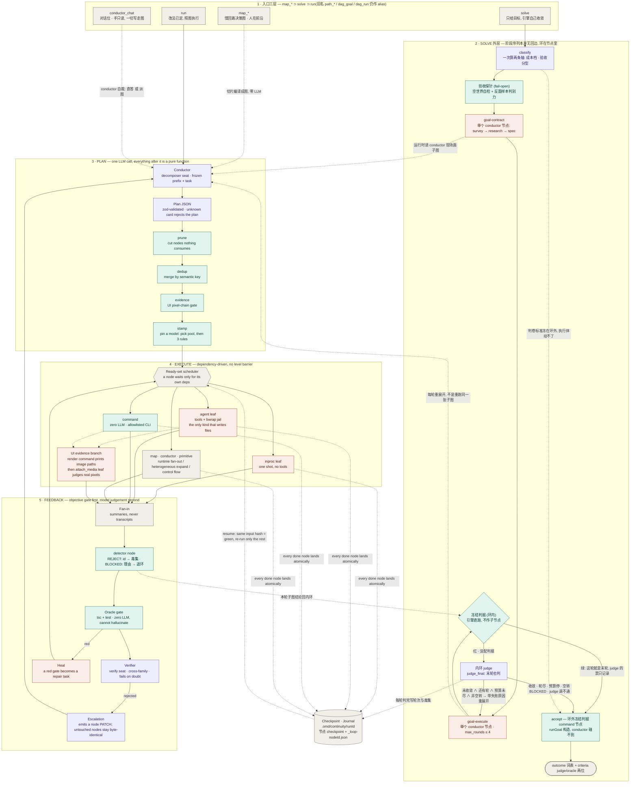
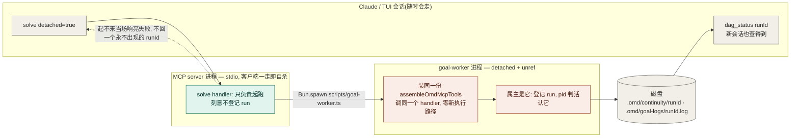
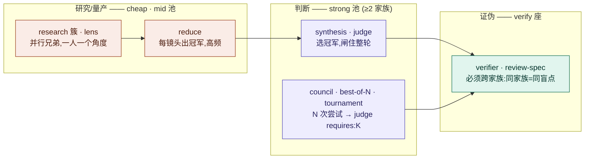

# 01 — DAG 引擎:架构与流转

- **Version**: v1.1.0
- **Status**: Active
- **Last updated**: 2026-08-10
- **Related**: [architecture](../architecture.md) · [model-layer](../model-layer.md) · [primitives](../primitives.md)

> 本图是**真理源**。改引擎 = 改这里的 Mermaid,`git diff` 即变更史。README 里嵌的是同一段代码块,
> 不是导出的图片 —— 栅格图改不动局部、diff 无意义、也没有地方写"为什么这么改"。

## Diagram

配色即语义:**紫 = 烧 LLM** · **青 = 确定性/零 LLM** · **橙 = 执行体** · **灰 = 引擎结构件**。
图内标签中英混排:三条泳道的英文原样保留(同一段 Mermaid 同时嵌进英文与中文 README,
单一真理源不做两份),2026-08 新增的 goal 外层与入口层用中文写 —— 它们的判据出自中文 SDD,
译一遍只会多一处会漂的措辞。

## 进程边界 —— detached 的 solve 活得比会话久

## 扇出角色与它们的档位

## Rationale(为什么是这个形状)

- **规划只有一次,其余全确定性。** 图画错的代价是全图白干,所以规划值得花 SOTA;而画完之后的
  每一步变换(剪枝/去重/证据闸/钉模型)都是纯函数 —— 同图进同图出,可测试、可 diff、不会因为
  模型今天心情不同而变。可靠性来自模型之外。
- **改图形状的 pass 必须排在 stamp 之前。** 任何新增节点的 pass 若排在 stamp 之后,新节点就拿不到
  池分配的模型 —— 补了等于没补。
- **oracle 闸与 verifier 分开画,不合并成"审核"。** 前者是 `tsc`/test,零 LLM,不会幻觉,是精度背板;
  后者是模型判断,是召回。把两者混成一格会让人以为"审过了"是同一件事。
- **verifier 必须跨家族。** 同家族模型共享训练偏好与盲点,自己证伪自己等于走过场。
- **escalation 出补丁而不是新图。** 指望重规划模型「逐字保留其余节点」是不可靠的(跨轮重措辞很常见);
  改成只输出节点补丁、引擎程序化 merge 之后,未补丁节点字节不动,语义指纹复用按构造成立。
- **checkpoint 画成旁挂而不是流程中的一环。** 它对主流程是透明的:写失败只 warn 不阻断
  (fail-open),但 resume 时它是唯一的真相来源 —— 输入哈希不变的节点直接判绿。
- **入口画成三层而不是一张工具清单。** `map_*` ⊃ `solve` ⊃ `run` 三层各自承诺的是**谁来决定改法**:
  人在前沿裁 / 引擎自己收敛 / 改法已定照图跑。旧名(`path_*` / `dag_goal` / `dag_run`)只在
  装配层挂 alias,行为逐字相同 —— 真源是 `src/mcp/tool-renames.ts` 那张表,删条目 alias 即消失。
- **goal 的阶段序列无回边,环画在 `goal-execute` 节点里。** 2026-07-30(D-F)撤掉了 run 级 fixpoint:
  两层 verify 成本翻倍,且"谁负责收敛语义"两层打架。撤了之后「整体目标成了吗」没有别的层来问,
  于是补 `judge_final` —— 末轮必判。少了它,`solve` 只能拿"跑完了"当"成了",那是谎报完成最舒服的入口。
- **一轮 = 重展开,不是重跑同一张子图。** 把上轮失败原因喂回 conductor 让它**重新画**,才可能长出
  上一轮压根没有的那一步(例如补一次调研);重跑同一张图只能把同样的活再干一遍。也正因如此,
  外层不需要回边:每一轮都是一张全新的无环子图。
- **冻结判据画两处,一处环内一处环外,而且都不由 conductor 构造。** 环外那个 `accept` 节点是收尾时的
  权威判定(此前只把判据写进任务文本,实测 conductor 没把它连进图 —— 冻结的是 `grep -qx …`,
  它自己画的验证步是 `cat`,于是"执行型验收"在生产上从没真跑过)。环内那份只管"能不能早点停",
  且**引擎直接跑、不作子节点** —— 一旦做成子节点,judge 渲染子节点事实时就会看见结论直接抄,
  两条判据永远一致,而判据轴要量的恰恰是它们的**不一致**。
- **判据绿即停,judge 的票只记录。** 判据本身已过空世界自检与反面样本探针两道筛,有停止权;
  而 judge 那一票单独带出去,才观测得到「判据过了但 judge 说没成」这一格(= judge 太紧)。
  两态压平只剩「judge 太松」看得见,这条轴就只剩一半。
- **验收探针 = 让判据自己先过一关。** D-I 冻结判据防的是执行体移动球门,防不了球门生下来就是虚的:
  空世界自检问"活还没干它就过了吗",判别力探针拿分类器自己举的一份**明显错**的产物去跑,
  照样过 = 对的答案和错的答案都满足它。两道都 fail-open —— 它们是加固,不是前置条件。
- **detector 画进 fan-in 而不是另设一层审核。** 普通节点只看得见自己的 `depends_on`,而 fan-in 节点
  天然看得见一批兄弟的产出,缺的只是让它的判断**落进环**(`REJECT:` 进毒集 / `BLOCKED:` 退环),
  而不是留成一段没人读的文字。首选 `executor:'command'`:确定性 oracle 说"谁坏了"比再请一次 LLM
  既便宜又可信。
- **环状态落节点级 journal,不塞进 checkpoint。** checkpoint 只在节点 **done** 时写,而环没收敛就没有
  done —— 崩在环中间等于毒集蒸发,正好是要防的那件事(被拒的产出借崩溃复活比不复用更坏)。
  于是 `_loop-<nodeId>.json` 每轮判完写一次,键从 runId 降到 runId + nodeId。
- **detached 单画一张进程边界图。** MCP server 是 stdio,客户端一走即自杀 —— 「无人值守」在那条路上
  物理上不成立。子进程装同一份工具、调同一个 handler(零新执行路径),而**登记 run 归 worker**:
  母进程抢先登记会在磁盘上留下一条属主随时会走的记录,下一个 session 一读就把正在跑的 run 判成
  "被打断"。代价是有个毫秒级窗口查无此 run,写进回话里。

## Changelog

| Version | Date | Change | Reason |
|---|---|---|---|
| v1.1.0 | 2026-08-10 | 主图加**入口三层**(`map_*` ⊃ `solve` ⊃ `run` + `conductor_chat`)与 **SOLVE 外层泳道**(classify + 验收探针 → goal-contract → goal-execute → 环内冻结判据/内环 judge → 环外 accept → outcome);新增**进程边界图**(detached worker);EXEC 泳道补 `conductor` 运行时展开,FEEDBACK 泳道补 detector 节点;checkpoint 方块并入节点级环 journal;rationale 加 8 条(三层入口 · D-F 撤外层环 + judge_final · 重展开语义 · 判据两处 · 判据绿即停 · 验收探针 · detector · 进程边界) | 2026-08-03 goal 引擎上线后本图缺整条 `solve` 通路:图上读不出"目标怎么变成收敛",也读不出 detached 跑在哪个进程里。同期 `executor-dag*` 家族改名 `src/harness/dag/`(4a0909a)、`conductor_chat` 入口(beb2a1b) |
| v1.0.0 | 2026-07-26 | 首版:三段泳道 + UI 证据支线 + oracle/verifier 分列 + heal/escalation 两条回路 + checkpoint 旁挂 + 扇出角色档位图 | 承 bluebell 图体系裁决,把架构图从手摆的 SVG 换成 Mermaid 真理源:手摆坐标改不动局部,且引擎会一直变 |
