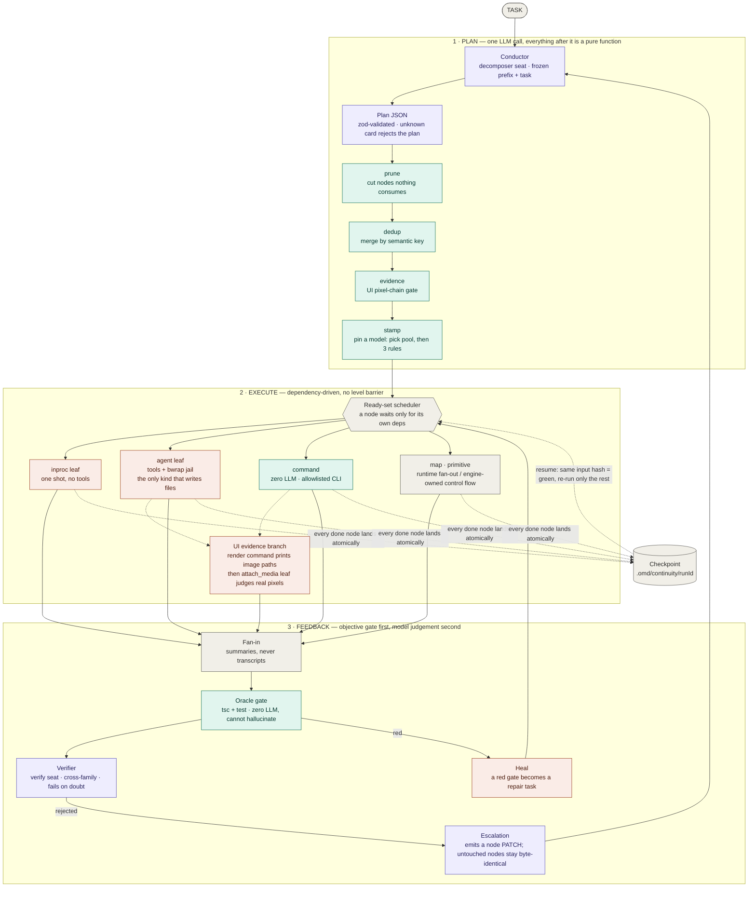
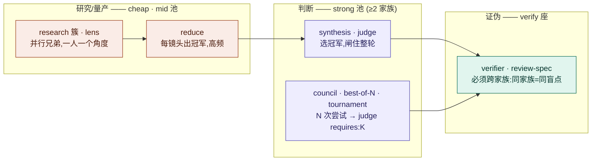

# 01 — DAG 引擎:架构与流转

- **Version**: v1.0.0
- **Status**: Active
- **Last updated**: 2026-07-26
- **Related**: [architecture](../architecture.md) · [model-layer](../model-layer.md) · [primitives](../primitives.md)

> 本图是**真理源**。改引擎 = 改这里的 Mermaid,`git diff` 即变更史。README 里嵌的是同一段代码块,
> 不是导出的图片 —— 栅格图改不动局部、diff 无意义、也没有地方写"为什么这么改"。

## Diagram

配色即语义:**紫 = 烧 LLM** · **青 = 确定性/零 LLM** · **橙 = 执行体** · **灰 = 引擎结构件**。
图内标签用英文:同一段 Mermaid 同时嵌进英文与中文 README,单一真理源不做两份。

## 扇出角色与它们的档位

## Rationale(为什么是这个形状)

- **规划只有一次,其余全确定性。** 图画错的代价是全图白干,所以规划值得花 SOTA;而画完之后的
  每一步变换(剪枝/去重/证据闸/钉模型)都是纯函数 —— 同图进同图出,可测试、可 diff、不会因为
  模型今天心情不同而变。可靠性来自模型之外。
- **改图形状的 pass 必须排在 stamp 之前。** 任何新增节点的 pass 若排在 stamp 之后,新节点就拿不到
  池分配的模型 —— 补了等于没补。
- **oracle 闸与 verifier 分开画,不合并成"审核"。** 前者是 `tsc`/test,零 LLM,不会幻觉,是精度背板;
  后者是模型判断,是召回。把两者混成一格会让人以为"审过了"是同一件事。
- **verifier 必须跨家族。** 同家族模型共享训练偏好与盲点,自己证伪自己等于走过场。
- **escalation 出补丁而不是新图。** 指望重规划模型「逐字保留其余节点」是不可靠的(跨轮重措辞很常见);
  改成只输出节点补丁、引擎程序化 merge 之后,未补丁节点字节不动,语义指纹复用按构造成立。
- **checkpoint 画成旁挂而不是流程中的一环。** 它对主流程是透明的:写失败只 warn 不阻断
  (fail-open),但 resume 时它是唯一的真相来源 —— 输入哈希不变的节点直接判绿。

## Changelog

| Version | Date | Change | Reason |
|---|---|---|---|
| v1.0.0 | 2026-07-26 | 首版:三段泳道 + UI 证据支线 + oracle/verifier 分列 + heal/escalation 两条回路 + checkpoint 旁挂 + 扇出角色档位图 | 承 bluebell 图体系裁决,把架构图从手摆的 SVG 换成 Mermaid 真理源:手摆坐标改不动局部,且引擎会一直变 |
