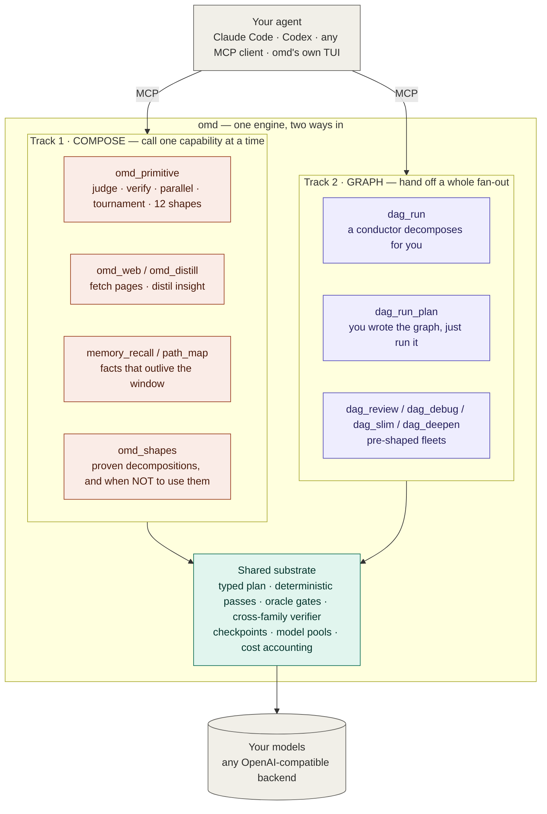

# 02 — 两条主线:组合模式与图模式

- **Version**: v1.0.0
- **Status**: Active
- **Last updated**: 2026-07-26
- **Related**: [architecture](../architecture.md) · [01 engine flow](01-engine-flow.md) · [model-layer](../model-layer.md)

> 真理源。README(中英两份)嵌的是同一段代码块。

## Diagram

**怎么选**:2–5 步、每步你都想看一眼 → 组合模式。≥10 个节点要并发跑、要能断点续跑 → 图模式。
两边共用同一套闸与同一套模型经济学 —— 换轨道不换可靠性。

## Rationale

- **图不是入口,是一种执行模式。** 计划期那四个纯函数 pass(剪枝/去重/证据闸/钉模型)的价值随图的规模增长,而成本固定 —— 3 步的组合里它们一分钱不值,40 节点扇出里它们是命根子。所以入口该由**规模**决定,而规模判断正是调用方那个 SOTA agent 最擅长的。
- **两条线共用底座是重点,不是巧合。** 组合模式如果绕开闸,就退化成"用 MCP 包装的裸模型调用";图模式如果不能被单步调用,大量小活会被迫套一张图。共用底座让两条线互为退路。
- **谁当 harness**:探索性任务的规划不该钉进图里,而该在 harness 里涌现。omd 的答案是**调用方那个 SOTA agent 就是 harness** —— 不另建一个规划框架。

## Changelog

| Version | Date | Change | Reason |
|---|---|---|---|
| v1.0.0 | 2026-07-26 | 首版 | 定位从"图是唯一入口"改为双主线 |
