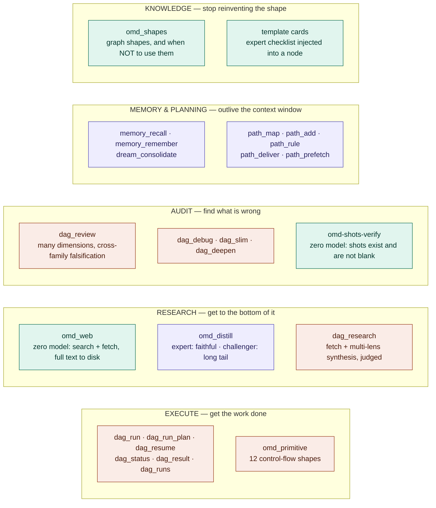

# 03 — 能力地图:哪些烧模型,哪些不烧

- **Version**: v1.0.0
- **Status**: Active
- **Last updated**: 2026-07-26
- **Related**: [mcp-tools](../mcp-tools.md) · [architecture](../architecture.md)

> 真理源。工具清单本身在 [mcp-tools.md](../mcp-tools.md);这张图只回答两个问题:
> **有哪几类能力** 和 **哪些是零模型的**。

## Diagram

**图内标签统一用英文** —— 同一段 Mermaid 同时嵌进中英两份 README,单一真理源不做两份(其余三张同规矩)。

**青 = 零模型**(可计算、不会幻觉、失败必然可见)· **紫 = 每次都调模型** · **橙 = 混合**(图里既有 command 闸也有 leaf)。

零模型的那几个是整套设计的承重墙:`omd_web` 只抓不判、`omd-shots-verify` 只数像素不评美丑、`omd_shapes` 只发知识不做决定。**它们坏了会立刻红,不会静默通过。**

## Rationale

- **按"烧不烧模型"上色,而不是按功能上色。** 功能分组读者自己看名字就能猜;真正影响成本与可靠性的是"这一步会不会幻觉"。
- **`omd_web` 与 `dag_research` 刻意分开画。** 前者零模型只负责把料拿回来,后者才做综合判优 —— 三段链(抓/综合/蒸)独立可调是它们的设计前提,画在一起会让人以为必须一起用。
- **卡(template)也画进来。** 它不是 MCP 工具,但它是"知识"这一类里与 `omd_shapes` 对偶的另一半:shape 管图长什么样,card 管节点里怎么干活。

## Changelog

| Version | Date | Change | Reason |
|---|---|---|---|
| v1.0.0 | 2026-07-26 | 首版 | 需要一张能力全景, 并标出零模型的那几处承重墙 |
| v1.0.1 | 2026-07-26 | 图内标签中文 → 英文 | 与其余三张对齐; 此前它是唯一一张中文图, 嵌进英文 README 后中英混杂 |
