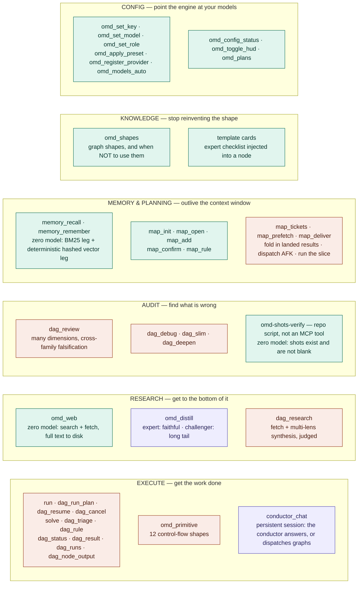

# 03 — 能力地图:哪些烧模型,哪些不烧

- **Version**: v1.1.0
- **Status**: Active
- **Last updated**: 2026-08-10
- **Related**: [mcp-tools](../mcp-tools.md) · [architecture](../architecture.md)

> 真理源。工具清单本身在 [mcp-tools.md](../mcp-tools.md);这张图只回答两个问题:
> **有哪几类能力** 和 **哪些是零模型的**。
>
> **⚠ 两份 README 嵌的副本落后于本块**(2026-08-10):README 版停在 8/09,缺
> `conductor_chat` · `dag_node_output` · `map_init/map_tickets/map_confirm` · CONFIG 一组,
> 且把 `memory_*` 标成紫色。改 README 时以本块为准覆盖过去。

## Diagram

**图内标签统一用英文** —— 同一段 Mermaid 同时嵌进中英两份 README,单一真理源不做两份(其余三张同规矩)。

**青 = 零模型**(可计算、不会幻觉、失败必然可见)· **紫 = 每次都调模型** · **橙 = 混合**(图里既有 command 闸也有 leaf)。

零模型的那几个是整套设计的承重墙:`omd_web` 只抓不判、`omd-shots-verify` 只数像素不评美丑、`omd_shapes` 只发知识不做决定、CONFIG 一组只读写 `.omd/config.json` 与凭证在不在。**它们坏了会立刻红,不会静默通过。**

**图内这 40 个名字 = 当前注册面的全部新名**(另有 9 个旧名以 deprecated alias 身份同时挂着,真源 `src/mcp/tool-renames.ts`,合计 49 = 两份 README 徽章上那个数)。

## Rationale

- **按"烧不烧模型"上色,而不是按功能上色。** 功能分组读者自己看名字就能猜;真正影响成本与可靠性的是"这一步会不会幻觉"。
- **`omd_web` 与 `dag_research` 刻意分开画。** 前者零模型只负责把料拿回来,后者才做综合判优 —— 三段链(抓/综合/蒸)独立可调是它们的设计前提,画在一起会让人以为必须一起用。
- **卡(template)也画进来。** 它不是 MCP 工具,但它是"知识"这一类里与 `omd_shapes` 对偶的另一半:shape 管图长什么样,card 管节点里怎么干活。
- **`conductor_chat` 单画一格,不塞进 EXEC 那一行。** 别的执行工具是"给它一个任务",它是"给它一句话" —— conductor 自裁直接答还是派图,每次调用必然跑一轮模型循环,所以它是这张图里少数几个纯紫的格子之一。
- **记忆两工具是零模型的**(2026-08-10 更正)。默认装配 `createOmdMemory({ path, safeguard })` 不注入 `EmbedFn`,于是向量腿走 `defaultEmbed = hashEmbed` —— 一个确定性的本地哈希词袋投影,不是语义模型;词法腿是 FTS5 的真 BM25。整条召回路径零网络零 key。想要真语义召回要在建库时注入别的 `EmbedFn`,那才是紫的。
- **`map_*` 八件套按"会不会真花钱"劈成两格。** 开图/建票/确认/裁决只动磁盘上的真相文件;而 `map_tickets`(折入已落地结果 + 预算内自续派发)· `map_prefetch`(派 detached AFK 进程)· `map_deliver`(编译切片真跑图)会引出模型开销。一格全画紫会让人以为看一眼前沿都要付钱。

## Changelog

| Version | Date | Change | Reason |
|---|---|---|---|
| v1.0.0 | 2026-07-26 | 首版 | 需要一张能力全景, 并标出零模型的那几处承重墙 |
| v1.0.1 | 2026-07-26 | 图内标签中文 → 英文 | 与其余三张对齐; 此前它是唯一一张中文图, 嵌进英文 README 后中英混杂 |
| v1.1.0 | 2026-08-10 | 补 `conductor_chat` / `solve` / `dag_cancel` / `dag_node_output` / `dag_triage` / `dag_rule` / `map_init`·`map_tickets`·`map_confirm` / CONFIG 一组; 旧名 `dag_run`→`run`、`path_*`→`map_*`; `memory_*` 由紫改青; `map_*` 拆成零模型与混合两格 | 图停在 7/26, 期间 goal 引擎上线 (2026-08-03, decl 见 `docs/plan/2026-08-03-goal-engine-upgrade.md`) 与对话位上线 (beb2a1b, 2026-08-09) 都没进图; 逐条对过 `src/mcp/tools/` 的注册面后按 40 个新名重画。`memory_*` 那格是**错色不是缺项** —— 默认 embedder 是确定性哈希投影, 图里却按"每次都调模型"标了两周 |
