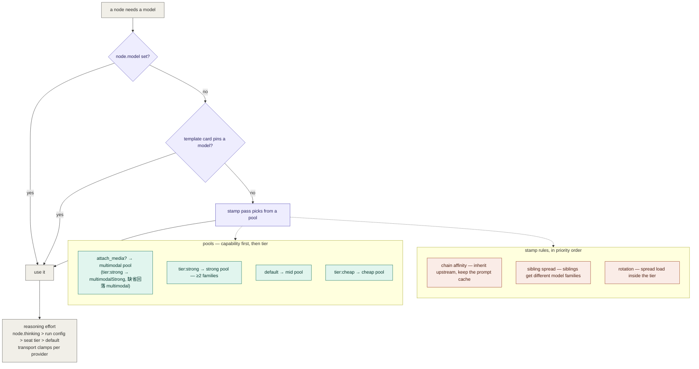
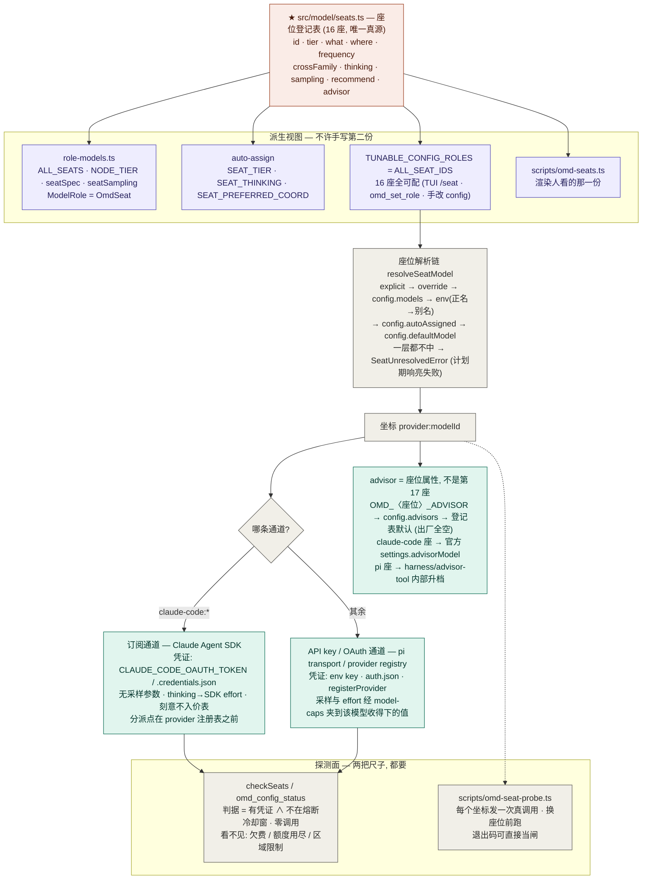

# 04 — 模型层:一个模型怎么落到一个节点上

- **Version**: v1.1.0
- **Status**: Active
- **Last updated**: 2026-08-10
- **Related**: [model-layer](../model-layer.md) · [model-config](../model-config.md) · [tui](../tui.md) · [01 engine flow](01-engine-flow.md)

> 真理源。文字版细节在 [model-layer.md](../model-layer.md);这两张图只回答"**谁决定了这个节点用哪个模型**"
> 与"**那个坐标是从哪张表来的、经哪条通道发出去的**"。

## Diagram — 节点选模型

两件事分得很开,这是刻意的:**卡(card)说"怎么做"** —— 方法论、检查单、输出纪律;**座位与池说"谁来做"** —— 模型坐标。同一张卡能跑在任何模型上,同一个模型能执行任何卡。这是它与 subagent 最大的结构差别:subagent 把这两件事焊死在一个定义里。

## Diagram — 座位真源 · 通道 · 探测面

**座位 = 模型选择轴, 不是角色轴。** 它回答「这一类活派给哪个模型 / 用多大 effort / 多发散」,不回答「这个角色是谁」。所以四个不同的判别类调用可以共用一个 `judge` 座;而判「达成没有」的闸(`gate`)与判「哪个更好」的择优(`judge`)要的东西不同、频率也差一个量级,于是它们是两个座。TUI 侧的入口(`/seat` · `/models` · `/login` · `/settings`)细节见 [tui.md](../tui.md);配置文件与 provider 那一半见 [model-config.md](../model-config.md)。

## Rationale

- **能力约束优先于档位偏好**:看图的节点必须落进多模态池 —— 模型再强,没有图像端点就是看不见,而这与它的智商档位无关。
- **链亲和排在跨家族分散之前**:换模型 = 整个上下文冷发一遍。单消费者链上换模型是纯损失,所以先保缓存;只有在"同一个消费者有多个兄弟"时才刻意打散 —— 那里要的是**独立盲点**,不是缓存。
- **推理档随座位下发而不是全局一个值**:判/证座位该高,量产座位不必。而档位必须经 transport 按 provider **clamp** —— 发一个对方不认的值不是降级,是整个节点白挂。
- **座位真源是代码,不是 markdown**:这张表此前散在四处,每处只知道自己那一半。写成 markdown 只会变成第五处 —— 而这个仓一路撞见的都是同一个形态:声明面往前跑了、消费面没跟上,两边都不报错。所以真源是 `seats.ts`,人看的那份由 `scripts/omd-seats.ts` 渲染,`role-models.ts` 只剩派生视图。
- **全部 16 座可配,首屏只画 3 座**:`TUNABLE_CONFIG_ROLES` 从登记表派生(禁手抄),写入口能落任意座位;`/seat` 回执与 `/settings` 主表只画 conductor/leaf/verifier 三座,那是 30 行终端的**可绘区取舍**,不是"只有这三个能改"。
- **通道必须画进这张图,因为探测面漏掉一条通道是静默的**:订阅通道的凭证由 SDK 自理,不在 `getProvider` / `piHasCredential` 的可见面上。探测面对它恒判"无凭证",走兜底链的座位就在**所有进程**里静默降档到别的模型,而同一坐标的直调路照样成功 —— 两个答案永不相遇,没有任何东西看起来是坏的(issue #6)。**一次降级不留痕迹,所以它比崩溃难查。**
- **两把尺子量的不是同一件事**:`checkSeats` 的判据是"有凭证 ∧ 未熔断",它**不发调用** —— 欠费、额度用尽、区域限制在它眼里全绿(实测:16 座 0 不可用,而真调用当场 402)。探针花几十秒几十 token,换来的是"这个坐标现在真的回话"。便宜那把随时看,贵那把换座位前跑。
- **advisor 是座位属性不是第 17 座**:它随座位的**通道**分派实现(官方 server tool / 内部升档 tool),对 leaf prompt 同名同义,所以座位换通道不用改 prompt。出厂全空是刻意的 —— transcript 会外发给该 provider,这种事不自动替人选。

## Changelog

| Version | Date | Change | Reason |
|---|---|---|---|
| v1.1.0 | 2026-08-10 | 补第二张图(座位真源 → 派生视图 · 通道类型 · 探测面 · advisor);第一张图的多模态格补 `multimodalStrong`;卡片钉模型的例子去掉具体坐标 | 座位真源迁入 `seats.ts` 且全座位可配、advisor 进配置面、订阅通道进探测面(issue #6)、内建卡的硬绑坐标摘除 |
| v1.0.0 | 2026-07-26 | 首版 | 补一张"模型怎么落到节点上"的图 (此前只有文字) |
