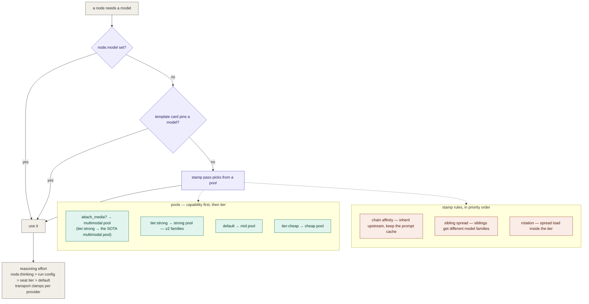

# 04 — 模型层:一个模型怎么落到一个节点上

- **Version**: v1.0.0
- **Status**: Active
- **Last updated**: 2026-07-26
- **Related**: [model-layer](../model-layer.md) · [01 engine flow](01-engine-flow.md)

> 真理源。文字版细节在 [model-layer.md](../model-layer.md);这张图只回答"**谁决定了这个节点用哪个模型**"。

## Diagram

两件事分得很开,这是刻意的:**卡(card)说"怎么做"** —— 方法论、检查单、输出纪律;**座位与池说"谁来做"** —— 模型坐标。同一张卡能跑在任何模型上,同一个模型能执行任何卡。这是它与 subagent 最大的结构差别:subagent 把这两件事焊死在一个定义里。

## Rationale

- **能力约束优先于档位偏好**:看图的节点必须落进多模态池 —— 一个文本模型再强也看不见截图(实测:量产主力 mimo-v2.5-pro 直接 404 "No endpoints found that support image input")。
- **链亲和排在跨家族分散之前**:换模型 = 整个上下文冷发一遍。单消费者链上换模型是纯损失,所以先保缓存;只有在"同一个消费者有多个兄弟"时才刻意打散 —— 那里要的是**独立盲点**,不是缓存。
- **推理档随座位下发而不是全局一个值**:判/证座位该高,量产座位不必;而且**transport 层按 provider 能力 clamp** —— 发一个该 provider 不认的档位不是降级,是 HTTP 400,整个节点白挂。

## Changelog

| Version | Date | Change | Reason |
|---|---|---|---|
| v1.0.0 | 2026-07-26 | 首版 | 补一张"模型怎么落到节点上"的图 (此前只有文字) |
