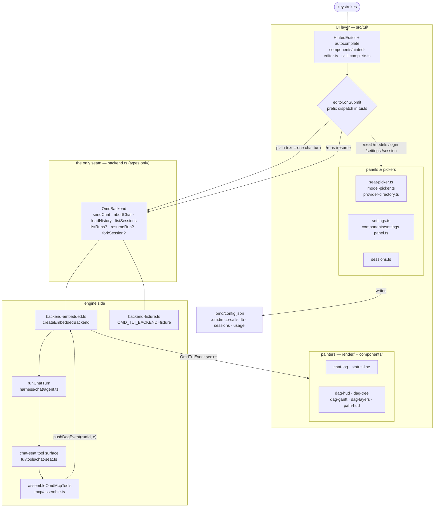

# TUI — the interactive terminal front end

[← README](../README.md) · [architecture](architecture.md) · [model layer](model-layer.md) · [MCP tools](mcp-tools.md)

`omd tui` is omd's own terminal client: a chat seat that can plan and drive DAG runs,
plus the panels that make the engine's own configuration (seats, providers, sessions,
runs) editable without leaving the screen.

The whole front end is built on one rule: **the UI knows exactly one shape of the
engine** — the `OmdBackend` interface in `src/tui/backend.ts`. Everything else is a
rendering decision.

## 1. Two assemblies, one UI

`src/tui/backend.ts` is a **type-only file** — zero runtime code. That is deliberate:
the moment it grows behaviour, each assembly starts growing its own branch.

| Assembly | File | When | Self-reported `connection.url` |
|---|---|---|---|
| embedded | `src/tui/backend-embedded.ts` | production default | `embedded://<conductor coordinate>` |
| fixture | `src/tui/backend-fixture.ts` | only when `OMD_TUI_BACKEND=fixture` | `fixture://l3-test` |

The fixture backend is not a fallback. It is installed **only** under that environment
variable, and it announces itself in the footer — so a fixture that leaks into
production is visible on screen rather than silently passing for a working engine.

The embedded backend calls the **same** `runChatTurn` (`src/harness/chat/agent.ts`) and
the same tool set as `omd serve`, so "in-process" and "remote daemon" are two wirings of
one path, not two paths.

### Optional capabilities are probed, not flagged

`listRuns`, `resumeRun` and `forkSession` are **optional members** of `OmdBackend`.
The UI tests `backend.listRuns ?` directly instead of consulting a separate
`capabilities` record — two places declaring the same fact drift. Under the fixture
backend those members are absent, so the corresponding entries do not appear at all,
rather than appearing and doing nothing when pressed.

### Event envelope

Push events carry a monotonically increasing `seq`. A gap in `seq` fires `onGap`, which
is the only way a remote assembly could ever notice a dropped frame; the embedded
assembly emits it too so the UI code never forks on assembly. The vocabulary is pinned
to five kinds — `chat` · `tool` · `dag` · `run` · `session`.

Node-level DAG events do not arrive through a backend method. The tool surface is
assembled *before* the backend exists (tools must be handed to `runChatTurn`), so the
backend exposes a `DagEventSink.pushDagEvent(runId, e)` inlet, wired up in
`src/harness/cli.ts` via a deferred pointer.

## 2. Shape of the front end

## 3. Commands

`src/tui/commands.ts` holds `COMMANDS` — **a list for humans, not a registry**.
Dispatch is still a chain of prefix checks inside `editor.onSubmit` in `src/tui/tui.ts`.
Because two declarations of one fact drift, `src/tui/commands.test.ts` gates the pair:
every command in the list must have a real handler in `tui.ts`, keyed by the
`handler` field rather than by the command name appearing anywhere in the file — an
earlier version of that gate passed on **comments** alone.

| Command | Arguments | What it does | Side effect |
|---|---|---|---|
| `/help` | — | prints the table (also `/?`, `/h`) | no |
| `/skill` | `[name] [notes]` | lists skills by group; a name arms it for the **next** message | no |
| `/hud` | — | toggles the DAG sidebar (Ctrl+G fullscreen, Tab cycles tree/gantt/layers) | no |
| `/models` | — | switches the chat seat model, filterable, current one marked | writes `.omd/config.json` |
| `/seat` | `[role] [provider:model]` · `advisor <seat> <coord\|none>` | lists tunable seats; with arguments it writes the seat | writes `.omd/config.json` |
| `/settings` | — | settings panel: seats / ui / approval / providers / session / extensions | writes on change |
| `/login` | `[provider]` | stores an API key for a provider (masked echo) | writes credentials |
| `/session` | `[id \| new [id]]` | lists sessions; an id switches and replays; `new` starts fresh | switches session |
| `/runs` | — | lists DAG runs (in-memory registry + on-disk checkpoints) | no |
| `/resume` | `<runId>` | resumes a broken run from its checkpoint | starts a run |

Skill **groups** are a second, dynamic family: any `<group>-*` skill directory produces a
`/<group>` command (`/omd`, `/lark`, …). Groups are scanned from disk on every slash
command, so a newly installed skill is dispatchable without restarting — the
autocomplete list, by contrast, is computed once at startup, a deliberate trade
(`slashCommands()` in `src/tui/commands.ts`).

Typing `/` at the start of the line offers **commands**; typing `@` or part of a path
offers file names (`src/tui/skill-complete.ts`).

## 4. `/login` and `/models` — the full provider directory

Before this, `/login` listed only what credential discovery could *see*, which on a fresh
machine is an empty table. `src/tui/provider-directory.ts` builds the catalogue as a
union of four existing sources, inventing no new one:

- pi-ai `getProviders()` — the vendor catalogue;
- `discoverProviders()` (`src/config/config-discovery.ts`) — custom and aliased entries;
- the `callModel` registry — providers registered from the environment;
- `claude-code` — the subscription channel, which has no id in the pi catalogue.

Each row carries a **three-state** status, not a boolean:

| Status | Meaning |
|---|---|
| `stored` | credential is on disk (`auth.json` / `models.json` / the Claude CLI credential file) |
| `env` | key comes from an environment variable — usable in this process, maybe not in another shell |
| `unconfigured` | neither |

Flattening `stored` and `env` into one boolean makes "why does it not work in my other
window" unanswerable, which is why the distinction is kept.

`claude-code` is special-cased in `handleLogin`: the subscription channel has no
"store a key" path, so the TUI points at `claude login` instead of opening an input box
that could only fail.

`/models` (`src/tui/model-picker.ts`) is the direct route for the most frequent action —
changing the chat seat's model — while `/seat` is the route for "change *which* seat".
The picker exists because the alternative was typing a coordinate from memory into a free
text box, and writing a seat does **not** validate that the coordinate resolves: a typo
produced a receipt saying "changed" and a seat that could never run.

The catalogue extension face on `ModelCatalogDeps` takes three fields and is only active
when all three are supplied. Omitted, `listModelChoices()` lists the registry only —
a pure function must not read real machine state by default, or every existing test
silently measures what this laptop happens to have configured.
`fullModelCatalogDeps()` in `provider-directory.ts` is the real-machine packaging.

Coordinates outside the catalogue go through the `MANUAL_COORD` sentinel (`"\u0000manual"`),
which cannot collide with a real `provider:model` string.

## 5. Seats and advisors

`src/tui/seat-picker.ts` renders **seats**, not bare model names. A list of model ids
does not say what a slot *does*, how often it is invoked, or why a tier is recommended —
and all three are already written in the seat registry `src/model/seats.ts`. The picker
therefore states no seat fact of its own; it is a view over the registry.

Every seat in `TUNABLE_CONFIG_ROLES` (`src/harness/init/headless-config.ts`, derived from
the seat registry) is editable. `CORE_SEATS` — `conductor` · `leaf` · `verifier` — is
only a **first-screen** trade: the `/seat` receipt and the `/settings` main table draw
those three plus an "N more" line, because the drawable area above the panel is a few
rows on a 30-row terminal. The full list is in the `/seat` panel itself.

**Advisors** are a seat *attribute*, not an extra seat, so they get their own command
form: `/seat advisor <seat> <coord|none>`. `none` **deletes the key** rather than writing
an empty string — an empty coordinate would be a fake value that reads as "configured".
An advisor row is drawn only when one is configured; absence is not rendered as `(none)`,
because absent and explicitly-none are different states. Configuring a cross-family
advisor on a `claude-code` seat warns at write time rather than after a run finishes.

`persistSeatAdvisor` in `src/model/role-models.ts` is the single write point, and it
removes the whole group key when the last advisor goes away.

## 6. Settings panel

`src/tui/settings.ts` builds the item list; `src/tui/components/settings-panel.ts` is the
resident pi-tui component that draws it.

The panel's rule is that **every row must answer "what is it now"**. A row that cannot is
not listed — a panel full of entries that do nothing when selected is exactly the
dead-link shape the repo forbids. Rows without an `action` are honest read-only status
lines: an extension that was rejected shows what it was missing; a glyph set never
measured on a real terminal says so; an unresolvable seat says unresolved.

Groups present: seats (core three + "more seats" sub-layer) · advisors · current session
and context pressure · colours and glyph whitelist · DAG sidebar default and fullscreen
painter · approval token TTL · provider credentials (configured or not — never the key) ·
extensions.

The outer loop around the panel handles exactly two rows — *current session* and
*provider credentials* — because those jump into another flow that opens its own dialog,
and the dialog host draws one at a time. Everything else changes value inside the
resident component, so the loop never touches it. Re-opening after a credential write is
correct: a freshly stored key must read back as configured.

## 7. Sessions and runs

`handleSession` in `src/tui/tui.ts` (parser in `src/tui/sessions.ts`) covers list, switch,
`new`, and fork.

Switching **clears the screen and replays that session's history**. Not replaying leaves
the previous conversation on screen masquerading as this one's context: the model sees
one transcript and the human sees another, both non-empty — the hardest divergence to
find. Both the textual form and the picker route through one `switchTo()` helper for the
same reason.

A failed switch leaves `sessionId` untouched. A half-switch would send the next turn into
a session that does not exist. Fork is the same rule: if `forkSession` returns `ok:false`,
the UI stays where it was and prints the reason.

`handleRuns` covers `/runs` and `/resume`. Both go through the optional backend
capabilities; when the backend does not expose them the UI says so explicitly rather than
failing silently. Under the embedded assembly these are wired to the `dag_runs` and
`dag_resume` MCP tools directly — **not through the model** — via the `mcpTools` dependency
in `EmbeddedBackendDeps`.

## 8. Cross-cutting layers

| Layer | File | Point |
|---|---|---|
| Approval gate | `src/tui/approval/gate.ts`, `policy.ts`, `card.ts` | approval wraps the tools, it is not prose in a prompt. Four tiers (`read` / `read_sensitive` / `write` / `admin`); `admin` never issues a token. Fail-closed when no ask handler is attached. |
| Usage ledger | `src/tui/usage/ledger.ts` | one record per call, rolling 5-hour window. Both `engine` and `chat` sources enter through the single `emitModelUsage` hook; the source label comes from the emitter, never invented at the subscriber. |
| Extensions | `src/tui/ext/host.ts`, `protocol.ts`, `runner.ts` | one child process per extension, sandboxed under bwrap when available. `systemPrompt` is append-only, and the check runs in the **parent**. Loading fails loudly with a list of missing APIs rather than running half-wired. |
| Context health | `src/tui/health.ts` | reading the same file three times in one session lights one line; it occupies no row when healthy, and the counter resets per session, not per process. |
| Log redirect | `src/tui/logging.ts` | the TUI owns the terminal, so the whole program's logs go to a file before `runOmdTui` is called. |
| Boot failure | `src/tui/boot.ts` | seats are configured **per repo**, so any repo other than omd's own hits an unresolved-seat throw on first run. This layer translates it and prints two runnable commands — while keeping the original message verbatim. |
| Theme / glyphs | `src/tui/theme.ts`, `src/tui/render/glyph-table.ts` | glyph widths are a probe artefact with three states (`SAFE` / `NEEDS_TTY` / `UNSAFE`), and every piece of chrome text lives in one `CHROME` object so the width gate can scan exactly one place. |
| Keybindings | `src/tui/keys.ts` | pi-tui's default table and omd's dialog table each lacked one encoding the other had; the missing one is added *through pi-tui's own* `setUserBindings`, so conflict detection keeps working. |

Ctrl+C is intercepted through `tui.addInputListener` with `consume: true`, ahead of focus
dispatch — under raw mode Ctrl+C is a plain `\x03` byte and produces no SIGINT, so without
this the session cannot be exited at all. Two presses within `CTRL_C_WINDOW_MS` (500 ms)
exit; the decision itself is the pure function `decideCtrlC`, with the clock injected.

## 9. How it is verified

| Layer | Where | What it proves |
|---|---|---|
| L1 unit | 27 `*.test.ts` files under `src/tui/` | parsers, formatters, and every extracted pure function (`decideCtrlC`, `pathHudVisible`, `buildSettings`, `seatRows`, `listProviderRows`, …) |
| L3 PTY | `scripts/tui-pty-check.mjs`, driven by `src/tui/tui-pty.test.ts` | the loop boots, pi-tui really renders, keys arrive, streaming assembles, Ctrl+C exits clean — 111 assertions across 10 scenarios |

The PTY lane runs on **node**, not bun: `@lydell/node-pty` returns zero bytes under a bun
host, measured directly. A bun-hosted PTY test would receive empty output, making every
`includes()` false and every `not.toContain()` true — a gate that looks alive and verifies
nothing. `tui-pty.test.ts` therefore only shells out and collects the exit code, and it
fails loudly when node is absent rather than skipping.

The lane runs against `OMD_TUI_BACKEND=fixture`, so it proves **nothing** about engine
behaviour, real models, session persistence, or DAG execution. Its oracle normalises
visible text (strip ANSI → collapse whitespace → substring) and **that oracle has its own
reverse self-test** which runs before any scenario; raw ANSI snapshots are never taken,
because a snapshot goes red on any layout tweak and is therefore equivalent to no test.

One assertion was withdrawn rather than kept: "the pathfinder summary disappears once
there is a conversation" stayed green even with the condition deleted, because pi-tui
redraws differentially and an unchanged on-screen line never re-enters the byte stream.
It was replaced by a unit test on `pathHudVisible` plus a recaptured frame under
`docs/bars/refs/`.

## 10. Entry point

`omd tui` is assembled in `src/harness/cli.ts`. Order matters in two places: log redirect
happens **before** `runOmdTui`, and the tool surface is assembled **before** the backend
(tools have to exist to be handed to `runChatTurn`), with the DAG event path closed
afterwards through a deferred pointer. The TUI subtree is loaded by dynamic import so it
never enters the resident memory of the `mcp` and `serve` paths.

The chat seat's tool surface is assembled by `createChatSeatTools` in
`src/tui/tools/chat-seat.ts` — extracted out of an inline block in `cli.ts` precisely so
that "which tools does the chat seat actually have" is something a test can assert
against (`src/tui/tools/chat-seat.test.ts`), rather than something you grep for.

Order is meaningful — it is the enumeration order in the system prompt:

| Group | Source | Mounted when |
|---|---|---|
| the six hands — `read` `write` `edit` `ls` `grep` `bash` | `createOmdAgentTools` | always, scoped to `cwd` |
| command-seat tools (run / solve / status / graph library / map / memory recall) | `createConductorChatTools`, `src/serve/chat-tools.ts` | always |
| symbol tools | `createCodegraphTools` | only if codegraph is detected |
| skill tools | `createSkillTools` | only if at least one skill exists |
| external MCP meta-tools | `createMcpClientTools`, see [open ecosystem](open-ecosystem.md) | only if a server is registered |
| `ask_user` | `createAskUserTool` | only when a dialog host exists |
| extension tools | `src/tui/ext/host.ts` | per loaded extension |

The optional groups are **capability probes**: absent capability means the tool name does
not appear at all. Mounting a tool that is guaranteed to fail is worse than not having it.

`HAND_TOOLS` is exported as the gate's source of truth: without write there is no way to
change code, and without bash there is no way to verify the change. The dispatch
discipline — do small work directly, send genuinely shardable work to a DAG — lives in the
`<hands>` section of the system prompt, not in the tool list.

One invariant is pinned by `chat-seat.test.ts`: **there is always exactly one gate layer**.
When an approval gate is supplied it wraps the whole surface and the hands' inner
`dangerousCommandGuard` is switched off (the `admin` tier takes over); when it is not, the
inner guard stays on. No assembly has neither.
