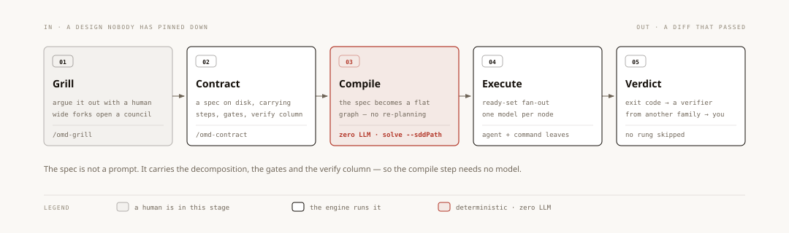

# Why omd exists

[← README](../README.md) · [getting started](guide/getting-started.md) ·
[architecture](architecture/overview.md)

This is the long version of the claim on the front page. It is about **which layer omd occupies**
and **who gets to decide the work is correct**. No install required to read it.

---

## 1 · Seven harnesses, one shared assumption

Take the open-source coding agents of 2026 apart and you find four schools of architecture.
There are the native-kernel ones — codex and oh-my-pi — that sink the hot path into Rust for
sandbox depth and a real tokenizer. There are the event-sourced platforms — deepseek-harness,
opencode, kimi-code v2 — where the session log is the single source of truth and the UI, the
recovery path and the telemetry are all projections of it. There is the product-ecosystem
school, qwen-code and kimi-code, building a full surface area around their own models. And
there is the standard-engineering school, gemini-cli, with a policy engine, OTel, evals and
perf baselines.

They differ enormously. On one thing they are identical.

**Every one of them is a session-layer tool.** The unit of work is a turn. The main loop is
ReAct: sample the model, run the tools it asked for, feed the results back, repeat. Everything
that makes them good — context compaction strategy, approval policy, sandbox nesting, event
replay — is in service of making that loop survive longer and behave better.

And the loop ends when the model says it's finished.

That is the assumption. **Whether the work is actually correct is something the model reports.**
Not measured, not checked — reported. "Done" is a sentence a model emits.

This is not a criticism of any of them. A session-layer tool cannot structurally do otherwise:
the thing that produced the work and the thing that assesses the work are the same forward pass,
in the same context, carrying the same beliefs. There is nowhere else for a verdict to come from
without stepping outside the session.

## 2 · What it costs when "done" is a sentence

The failures are not exotic. They are the ones you have already had.

*It said it was done, and it wasn't.* The summary says the file was edited. `git diff` says
otherwise. Nothing errored, so nothing turned red.

*The context ran out and it started over.* Forty minutes of work, most of it correct, and the
recovery path is to re-prompt and re-pay for all of it — because the session was the unit, and
the session is gone.

*You can't tell a real pass from a hollow one.* The model proposed an acceptance test and the
test passed. Did it pass because the work is right, or because the test would have passed
against anything? Nobody checked. Nobody could — the criterion and the work came from the same
place.

*The method only exists inside one person's prompt.* The way you review a diff, the way you
chase a root cause, the discipline for locking a plan — it lives in a text file that a good
model follows most of the time and quietly skips when the context gets long.

Each of these is a *silent* failure. Not a crash. Not an error message. The system reports
success and the success is not real. You find out later, from somewhere else.

## 3 · A different unit of work

omd is not in the session layer. It is the layer underneath, and the change that makes
everything else possible is small to state:

**The unit of work is a node, not a turn.**

A turn is opaque. It has no declared inputs, no declared outputs, no dependencies, no identity
that survives the conversation. You cannot resume half of it, run two of them in parallel and
know they don't collide, give one a cheap model and another an expensive one, or hand one to a
different model family for a second opinion. All of those are properties a turn structurally
lacks.

A node has all of them, because the interface is a **typed plan** — a zod-validated JSON graph
of `{ nodes[], outputs[] }`. That plan is a *seam*: the machinery downstream of it does not
care where it came from. A conductor model can draw it. A compiler can emit it with zero LLM
involvement from a decision map. You can write it by hand. All three produce the same object,
and the same four pure functions run over it before anything executes — prune dead nodes, merge
duplicates by semantic key, enforce the evidence gate, pin a model onto every node. Zero IO,
zero randomness, same input same output.

From that one change, the rest follows:

- **Dependencies are declared, so concurrency is safe.** The engine schedules by ready-set:
  everything whose inputs are satisfied runs at once.
- **Every node checkpoints atomically.** Resume re-checks input hashes; nodes whose inputs are
  unchanged stay green and are not billed again. Only the rest re-runs.
- **Every node can carry its own model.** Which brings us to seats — 18 of them, and a seat is a
  *model-selection axis*, not a role. Strong where being wrong is expensive and rare; cheap
  where volume is high and a deterministic check catches the mistakes.
- **Every node can be judged separately.** Which is the whole point.

## 4 · The verdict comes from outside the model

<div align="center">

</div>

A ladder, in order, no skipping.

### Rung ① — a mechanical oracle, zero LLM

A `command` node runs `tsc`, the test suite, a scanner, or your own script, and its exit code
must equal `expect_exit`. There is no model in the loop, so there is nothing to talk into
passing. Alongside it: write-set reconciliation — did the node write the files it claims it
wrote? — and artifact gates — is the file it named actually on disk? A node that reports a file
it never created fails. A "reviewed" screenshot that does not exist fails.

**And the criterion itself has to sit an exam before it is trusted.** This is the piece worth
reading twice, because it closes the hole every other acceptance scheme leaves open: a criterion
that always passes is indistinguishable from a criterion that passes for the right reason.

So the engine runs the proposed acceptance command **twice, in a throwaway world**:

- once **before any work exists**. If it is still green, it has nothing to do with this task.
- once against a **deliberately wrong artifact** — which the classifier had to supply alongside
  the command, precisely so this probe is possible. If it is still green, it cannot tell a right
  answer from a wrong one.

Either outcome demotes the goal to *exploratory* instead of collecting a fake pass. Both probes
are deliberately **fail-open**: when a probe cannot run, the criterion is accepted and *marked
as unproven* rather than blocking the run — so "was this goal judged by anything real" stays a
readable number instead of a belief. Source: `src/harness/goal/acceptance-gate.ts`.

**And here is the part that argues for the whole approach better than any feature list.** For a
long stretch, the discrimination probe went red exactly **zero** times. Of 348 recorded runs, 69
actually ran it; every one of the three demotions in that window came from the *other* probe.
Sixty-six out of sixty-six, no variance.

A gate that never fires is either guarding nothing or broken, and this repo's own rule is that
*a number which does not move under any intervention is usually measuring the ruler rather than
the thing being measured*. It was measuring the ruler. The "deliberately wrong world" had been
an empty temp directory containing only the bad sample — and in an empty directory `bun test`,
`tsc` and any relative-path check fail no matter what you put there. The probe was not asking
"can this criterion tell right from wrong"; it was asking "does this command break outside the
repo", to which the answer is always yes.

The negative world is now a real copy of the repository (`git archive`, plus a `node_modules`
symlink so the copy can actually run). The point is not that the bug existed. The point is that
the bug was *findable* — because the verdict is a five-way vocabulary written to a ledger per
run, a flat zero in one column was visible at all. Had the gate reported a boolean, it would
still be green and still be worthless.

### Rung ② — a verifier from a different model family

Some things no exit code can settle. Is this summary faithful to the source? Does this design
actually satisfy the contract? For those, a verifier reads the result against the original
requirements and produces pass or fail.

It must be a **different model family than the author.** A same-family self-review reuses the
same blind spots: the bad plan it produced is a bad plan it cannot see. And its job is framed as
attacking the result, not stamping it, because a reviewer asked to confirm will confirm.

Fail means escalate — a stronger conductor, the failure reason injected, a re-plan. The rejected
nodes and everything downstream of them re-run; the rest is reused unchanged.
Source: `src/harness/verifier.ts`.

### Rung ③ — a human

When neither rung can decide, it escalates to a person. Not deferred, not decided unilaterally.

### The corollary you have to hold onto

**Oracle-green is not the same as semantically right.** This engine has shipped a change with
`tsc` clean and the whole suite passing, where a status mapping was labelled backwards and the
accompanying test had frozen the mistake in place — the comment correct, the assertion
reversed. When a test and its implementation come out of the same change, they can be wrong
together *and endorse each other*.

That is exactly what rung ① cannot catch. It is why rung ② is not optional, and why the ladder
is a ladder rather than a menu.

## 5 · Reliability outside, creativity inside

State only the first half of the principle and you get a predictable failure: over-mechanising
the model away, replacing judgement with rules until the system is only as smart as its rules.
So both halves, together:

> **Reliability comes from outside the model. Creativity comes from inside it.**
>
> **Gates judge** — deterministic, zero-model, fail-closed. A model "having a look" is not a
> gate, because when it silently does not run, nothing turns red.
>
> **Models generate** — what to do, how to do it, what is still missing. Inside the gates, do
> not replace this with rules. Replacing generation with a mechanical rule marks the model's
> intelligence down to the expressive power of the rule.

Three corollaries that settle real design arguments:

1. **A deterministic detector is a floor, not a ceiling.** A set-difference over fetched URLs is
   an excellent floor for "what did we fail to read". It is a terrible substitute for "what
   should we look into next".
2. **Termination belongs to the engine; content belongs to the model.** Round caps, stop-after-K-
   dry-rounds, quorum — the engine counts. Asking a model "are we done yet?" reintroduces the
   exact silent failure the gates exist to remove.
3. **Gates sit at the joins, not on every step.** Treat a capable model like a capable person:
   you check the work where being wrong is expensive, and you do not read over their shoulder
   while they think.

The same split shows up in control flow. omd ships 13 primitives — `parallel`, `pipeline`,
`loop-until`, `verify`, `judge`, `discovery`, `iterate`, `tournament`, `router`, `race`,
`escalation`, `saga`, and `escape-hatch` which stays off unless you set `OMD_ESCAPE_HATCH=1`.
The model picks the shape and its parameters. The loop, the branch, the stop condition and the
scoring stay in code. Control flow that lives in a prompt is control flow a model can forget
halfway through.

## 6 · Where the overlap really is

Honest neighbours, honestly described.

|  | Session-layer harness | Workflow engine<br>(LangGraph, Temporal, Restate) | Eval & gate framework<br>(Inspect, promptfoo, Braintrust) | **omd** |
|---|---|---|---|---|
| **Unit of work** | a turn | a hand-authored step | a scored sample | **a node in a typed graph** |
| **Where the graph comes from** | there is no graph | you write it | there is no graph | **model, compiler, or hand-written — the engine only checks it validates** |
| **Who decides it's correct** | the model says so | the assertion you wrote | the rubric you wrote | **oracle → cross-family verifier → human, in that order** |
| **When it breaks mid-run** | the session ends | retry or compensate per policy | the run is graded and over | **per-node checkpoints; resume keeps green nodes green and unbilled** |
| **When gates run** | — | wherever you put them | afterwards, on a saved trace | **inside the same run that produced the artifact** |
| **How you invoke it** | you chat with it | you embed it in your app | you call it from CI | **over MCP, from whatever agent you already use** |

Graphs are not new — LangGraph and Temporal run them, and do durability better than most.
Gates are not new — `tsc` and a test suite predate all of this. What is combined here in one
engine, callable from a coding agent rather than embedded in an application, is: the typed plan
as the interchange format, gates that run inside the producing run rather than afterwards on a
trace, cross-family verification, atomic per-node resume, and an MCP surface so the session
layer you already use can drive all of it without adopting anything.

If you write application code and want durable workflows, use a workflow engine. If you want to
score model outputs offline, use an eval framework. If your work fits in one conversation, use
your coding agent and stop reading. omd is for the case in between: work that is bigger than a
conversation, that has to actually compile, actually cite, actually finish — and where you are
unwilling to take the model's word for whether it did.

### We ran the survey with omd, and you can re-run it

The claim "nobody else combines these" is the kind of claim that is usually decoration, so we
made it checkable. The seven properties are: a typed DAG plan as the *interface*; a deterministic
pre-action gate; an exit-code oracle; write-set reconciliation; a cross-model-family verifier;
per-node checkpoint and resume; and exposure over MCP so any session harness can call it.

The survey across three layers — session harnesses, workflow engines, eval and gating frameworks
— came back with **no system holding more than a partial hand**, and with structural reasons
rather than accidental ones:

- **Write-set reconciliation has no product in the coding-agent space at all.** It has to read
  the actual side effects at the moment a tool call returns, and orchestration engines only offer
  "write your own reconciliation code inside a node" — there is no filesystem-observation seam to
  attach to.
- **Cross-family verification exists as a pattern and in papers, not as a schema constraint.**
  Verification layers implement the verifier as *one more LLM call*; the model's family identity
  never reaches the schema, the verdict, or the checkpoint. It cannot be enforced if it is not
  recorded.
- **Existing MCP surfaces are workflow-level ops planes** — start, cancel, monitor, deploy,
  query history. None of them expose a plan you can submit or a per-node evidence plane you can
  query.

Two honest caveats. This survey was produced by a machine pipeline over fetched sources, so treat
individual citations as leads rather than as settled fact. And "nobody combines these" is not the
same as "this combination is obviously correct" — it is a reason to look, not a proof.

The point that survives both caveats: the question was answerable in one command, and the report
is on disk with its sources rather than in a slide.

```bash
bun run scripts/dag-research.ts "<your version of the question>" --deep
```

## 7 · What omd deliberately does not do

- **It is not a coding CLI.** There is no TUI to live in. (`omd tui` exists and is in
  development; it is not the point of the project.)
- **It is not a chat agent.** `conductor_chat` is a seat at the engine, not a product.
- **It is not an eval framework.** You do not ship it traces; the gates run inside the run.
- **It does not deliver on its own.** `map_deliver` is a trigger the *owner* pulls. Automation
  may research, fetch, plan and argue by itself. Changing files stays a human decision, every
  time.
- **It is not vendor-locked.** MIT, TypeScript on Bun, and every seat is a `provider:model`
  coordinate — anything OpenAI-compatible.

## 8 · Where to go next

| | |
|---|---|
| Hand it to your agent | [driving omd](driving-omd.md) — the operating guide, written for the agent |
| Install it yourself | [getting started](guide/getting-started.md) |
| Pick a door for a job | [workflow](guide/workflow.md) · [all 50 tools](guide/mcp-tools.md) |
| See how the engine is built | [architecture overview](architecture/overview.md) · [DAG engine](architecture/dag-engine.md) |
| See what it got wrong before | [silent failures](silent-failures.md) — every defect family this engine shipped with no red light |
